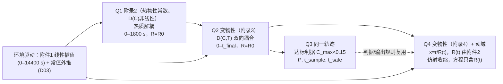

# A 题「药材的烘干问题」建模方案（执行版）

| 项目 | 内容 |
|---|---|
| 文档版本 | **v1.2（定点返修，2026-09-12）**。当前唯一执行版本；五份文件（本方案、决策日志、`A题_config.yaml`、`config_check.py`、自查报告）统一为此版本标识，旧 v1.1 不作基准 |
| 本次修订范围 | **本轮（PATCH-01~08）同步修补全部五份文件**，不再只在方案写「留待下游修改」却把配套原样交回：`config_check.py` 已重写为显式异常/`-O` 不失效并实拒八类变异+负半径；`A题_config.yaml` 已补分问数值配置/8·16 点求积/W-m 参考尺度/参数分类；决策日志旧执行口径就地标「历史规则，已失效」；自查报告只对本轮实提交文件下结论并附 PATCH 对照表。物理主线不变（见 §0.1 与返修文档「已经正确的主线不再改动」表） |
| 定点返修要点 | ① 消除 D12 循环依赖：D12 依**适用于该问的数值检验**选配置并登记，V-8/V-9 属导出后文件验收（非 D12 前置）。② Q1 仅解到 1800 s，不求 0.15 达标事件、不续算 600 s（仅 Q23/Q4 适用）。③ 网格按各问输出误差选定，删 N≥800/Q1 N≥1600 无条件写法；空间误差靠空间加密、时间误差靠容差/步长，分别核查。④ 补 BDF 累计通量增广态 I（2n+1）。⑤ 缩减必做，S7/S8/V-14、t_safe、S9 诊断图降级。⑥ 证据如实，外部探针与本轮执行分列 |
| 日期 | 2026-09-12（定点返修） |
| 交卷截止 | 2026-09-13 05:00（美国太平洋时间） |
| 下游实现 | Claude Code / Cursor；Python（NumPy / SciPy / openpyxl 或 XlsxWriter）求解，MATLAB 绘图（`iapws` 仅在已降级的潜热相容性检查中可选） |
| 范围 | Q1–Q4 全部 |
| 状态词约定 | 「已决」= 用户在对话中拍板；「设计已具备」= 规格已写清、尚未执行；「已执行通过」= 本对话代码复算一致的探针；「尚未执行」= 需下游运行；「待人工核验」= 参赛队须核对 |
| 本文档性质 | 方案与实现规格。**所有正式 PDE 场解、网格收敛验收、烘干时长 t\* 均尚未执行**；本文中出现的 t\* 等数值均为探索性探针（外部审查探针 + 本对话独立重跑），不是正式答案。独立审计结论：主模型设计基本对齐，无需推翻重建；修订重点为收缩范围、修正验收、如实证据，而非新增干燥机理 |
| 状态词补充 | 「决策已确认」/「规格已修订」/「数值待验证」/「实际通过/失败」分列；历史规则标「已失效，不作执行依据」 |

---

## 0. 决策摘要与版本信息

### 0.1 主线一句话

题给数据 + 题给经验公式 + 最少且显式的闭合假设：一维径向（中截面）有效扩散—导热模型；传质/传热第三类边界，环境量取附件 1（有效边界量）；Q2/Q3 共用一条轨迹；Q4 以附件 2 的 R(t) 驱动仿射收缩、在参考坐标 $x=r/R(t)$ 上求解；达标判据用全域未舍入极值的连续事件；拓展（潜热、等温线、混合焓）不入主线，且按审计 A §4.3/§8 已从必做运行与主文图表移出（仅留一句局限）；仅新增「附录 4 + 固定 $R_0$」一个题给公式内的对照以分离物性与几何效应。

### 0.2 已决决策一览（唯一执行版本）

| 编号 | 决策 | 执行值 | 状态 |
|---|---|---|---|
| D01 | 主线建模哲学 | C：最小主线 + 分层拓展（主模型 / 验证与主要歧义检查 / 有条件机理拓展） | 已决 |
| D01-b | 降维 | 一维径向主线；Q1–Q3 半径固定 $R_0$，Q4 径向收缩、L 固定；端面校核列入阶段 4 | 已决 |
| D02 | 传质边界口径 | A：$-D\partial_rC|_R=h_m(C_s-C_{env})$，$C_{env}(t)$=附件 1「水分浓度」数值（有效模型假设）；C（平衡含水率）仅在四道门槛满足时作情景；B（气相密度）不实施 | 已决 |
| D03 | 14400 s 后空气边界 | A：t>14400 s 常值 $T_{air}$=49.9989344262 °C、$C_{env}$=0.0499875409836（[10800,14400] s 含两端点 61 个原始样本算术均值，全精度计算）；14400 s 取原始节点，右侧显式切换，登记为求解断点 | 已决 |
| D04 | Q2–Q4 的 h、h_m | C：沿用 h=25 W/(m²·K)、$h_m$=8e-7 m/s（跨问沿用为额外有效系数假设）；情景各 0.5/1/2 倍；Q1 题给值不改 | 已决 |
| D05 | 潜热 | A：主线不计潜热；B（表面潜热汇）原为有门槛的条件性检验，**审计 A §4.3/§8 后移出必做与主文，仅留一句局限（8.3），可选单独运行**；C 不实施 | 已决 + 审计降级 |
| D06 | ρ(C) 角色、守恒、质量—几何闭合 | Ⅰ-A：$b=\rho(C)c_p(C)$ 为有效体积热容；水分方程以 C 为变量；$\rho_{s0}=\rho(C_0)/(1+C_0)$ 仅用于质量换算。Ⅱ-A：Q4 几何由附件 2 给定，干物质守恒 → $\rho_s(t)=\rho_{s0}(R_0/R)^2$；B12b：t>72 h 保持 R=1.198 cm 并标注外推。Ⅰ-B 只登记不实施 | 已决 |
| D07 | 附件 1 数据处理 | A：0–14400 s 原始节点分段线性插值；一个 [1,2,1]/4 平滑情景（内点平滑、两端原值、再线性插值；外推段不变） | 已决 |
| D08 | result2 时间范围 | 1 s 网格至首个全域未舍入严格合格整数秒 $t_{end,1s}$ | 已决 |
| D09 | result4 列映射 | 固定 0, 0.1, …, 1.9 cm + 末列「药材表面」；域外真正留空；$r_j\le R(t)$（含相等，未舍入插值 R）为域内 | 已决 |
| D10 | Q4 运动学与数值 | K-1 仿射径向收缩 + N-1 参考坐标 ALE（网格速度 = 固体速度，方程只含 R(t) 不含 Ṙ） | 已决 |
| D11-M | 达标判据 | 全域未舍入极值；$t^*$ = 首次向下穿越 = 严格达标集合下确界（不一致须报告）；$t_{sample}$ 实测；$t_{safe}$ 只称数值裕量 | 已决 |
| D11-O | 输出呈现 | 表 5/6 末行取 $t^*$；result3/4 末行取 $t_{sample}$；不预填、不重复、全部表值同一未舍入重构；Excel 行数检查 | 已决 |
| B01–B14 | 常规约定 | 见第 3 节与第 9 节（B08→D01-b；B12b→D06） | 已决 |
| **D12** | 生产数值配置——**分问记录（A-F04）** | Q1 / Q23 / Q4 **各自**记录候选网格、最终网格、积分界面求积阶数（8/16 点 Gauss 独立键）、BDF 容差、步长上限、**必须检查项目**（拟执行；见 9.2 分问表「要求/实际结果」分列）。候选：`integral` 界面 + BDF（rtol 1e-8）；**网格按各问输出误差选定，不把 N≥1600/N≥800 写成无条件物理要求**；Q4 **不因「与 Q23 同配置」即视为已过自己的精度检查**。BE Δt=1 s、N=200、`harmonic` 仅为验证基线 | **待用户授权**：D12 依**适用于该问的数值检验**（Q1: V-1/2/3；Q23: V-3/4/6/11；Q4: V-3/4/10/13）选定并登记；**V-8/V-9 是导出后文件验收，非 D12 前置**（PATCH-02） |
| H01–H20 | 模型假设与计算约定 | 第 4 节（按审查意见 4 修订后冻结） | 已冻结 |

### 0.3 未实现 / 仅情景 / 历史备选（不自动启用）

| 项 | 性质 |
|---|---|
| D02-B 气相密度驱动 + 等温线 | 未实现 |
| D02-C 平衡含水率口径 | 仅在四道门槛满足时作情景；本次未实现 |
| D05-B 表面潜热汇 | **已移出必做与主文（审计 A §4.3、§8）**：不入主线、不生成 result、不入图表，仅保留一句局限（8.3）；可选单独运行 |
| D05-C 体积相变 | 未实现 |
| D06 Ⅰ-B 混合焓形式 | 仅登记，可选结构性拓展，未实现 |
| D06 Ⅱ-B 含水率驱动收缩 | 仅诊断图 $R_C(\bar C)$ vs 数据，不驱动模型 |
| D10 K-2 局部收缩、N-2/N-3 | 未实现 |
| D07-B PCHIP、D07-D 零阶保持 | 历史备选，未实现 |
| result2 固定 3 h / 72 h | **仅测试模式**（`output.result2_test_modes`），不得导出为正式 result2；正式导出仅 `until_dry_1s`（PATCH-04） |

---

## 1. 需求追溯矩阵（终版）

| 编号 | 需求 | 题面位置 | 载体 | 方案中的处理 | 所在节 |
|---|---|---|---|---|---|
| R01 | 圆柱 L=25 cm、R=2 cm | Q1 | 全部 | H01；Q4 R(t) 由附件 2 | 4, 6 |
| R02 | T0=28 °C、C0=2.55 | Q1 | 全部 | H02；初始角点处理 H05 | 4, 6.1 |
| R03 | 边界取附件 1 | Q1、附录 1 | 全部 | D07-A（0–14400 s）+ D03-A（其后） | 6.1, 9.3 |
| R04 | Q1 参数附录 2 | 附录 2 | Q1 | 6.1 参数表 | 6.1 |
| R05 | 表 1/2 | Q1 | 论文 | 同一未舍入解在 t=100,300,600,900,1200,1500,1800 s（7 时刻）、r=0,0.5,1,1.5,2 cm 取值 | 6.1, 9.5 |
| R06 | result1：1 s × 0.1 cm，1800 s | Q1、附录 1 | result1 | A 列 1…1800；21 空间列 + 1 时间列；工作表「温度」「水分浓度」 | 9.5 |
| R07 | 四位小数 | Q1「下同」 | 全部 | 仅输出时 round(·,4)，数值型 + `0.0000`；判据与验证用未舍入值 | 9.5 |
| R08 | Q2 全程，统一附录 3 | Q2、附录 3 | Q2/Q3 | 6.2；「2–3 天」仅量级参照 | 6.2 |
| R09 | 表 3/4 | Q2 | 论文 | t=0.5…3 h | 6.2, 9.5 |
| R10 | result2：1 s × 0.1 cm | Q2 | result2 | D08：1…$t_{end,1s}$；数据行 ≤1,048,575 检查 | 9.5 |
| R11 | 各处 C<0.15，时长 h | Q3 | 论文 | D11-M（F06 修订） | 6.2 |
| R12 | 表 5 | Q3 | 论文 | 6 h 行 + 末行 $t^*_3$ | 6.2, 9.5 |
| R13 | result3：60 s × 0.1 cm | Q3 | result3 | 60…$t_{sample,3}$ | 9.5 |
| R14 | Q4 按附件 2 + 附录 4 | Q4、附录 4 | Q4 | 6.3：K-1 + N-1；B12a/b | 6.3 |
| R15 | 表 6 列 0, 0.5, …, 药材表面 | Q4 | 论文 | 列 0, 0.5, 1.0, 表面（1.5、2.0 在 t≥6 h 全域外）+ 半径小表 | 6.3, 9.5 |
| R16 | result4 末列「药材表面」 | Q4 | result4 | D09 | 9.5 |
| R17 | AI 声明 + `AI工具使用详情.pdf` | 竞赛规定 S01 | 论文 + 支撑材料 | 第 13 节素材；正式 PDF 由参赛队编制 | 13 |

---

## 2. 数据体检报告（终版摘要；全文见决策日志第 2–3 节）

| 对象 | 事实 |
|---|---|
| 附件 1 | Sheet1；列 时间/温度/水分浓度；0–14400 s，Δt=60 s，241 点；无缺失、无重复时刻、无非有限值；T 28.000→50.165（max 50.246 @10620 s），C 0.01963→0.04986（max 0.05025 @9780、10080 s）；0–1800 s 两列未见下降步；全程非单调；噪声性质未识别；显示格式 `0.000` / `0.00000` |
| 附件 1 平台 | [10800,14400] s 61 点：T 均 49.9989344262（std 0.1544，趋势 +0.0028 °C/h），C 均 0.0499875409836；末点 (50.165, 0.04986)；以末小时均值为中心，[7200,14400] 内最大偏差 0.3869 °C / 0.0010475 |
| 附件 2 | Sheet1；列 时间/半径；0–259200 s，Δt=1800 s，145 点；2.000→1.198 cm 单调不增；降幅一半（R=1.599）约 2.36 h；36 h 起 ≤1.200；57.5 h 后 <1.200；67 h 起 1.198；显示 `0.000`（0.001 cm 台阶） |
| 模板（**本轮代码工程已用 openpyxl 实读 `附件/附件3/result1-4.xlsx`，2026-09-12；可追溯，PATCH-07**）| **分文件如实记录**——result1/2：工作表「温度」「水分浓度」，A1=`时间\到药材中心的距离`，表头 0, 0.1, 0.2, `…`, 2，A 列 1, 2, 3, `…`；result3：Sheet1，A1 同上、表头 0, 0.1, 0.2, `…`, **2**、A 列 60, 120, 180, `…`；**result4：Sheet1，A1 同上、表头 0, 0.1, 0.2, `…`, 「药材表面」（末列为「药材表面」，非「2」）、A 列 60, 120, 180, `…`**。模板均为**含 `…` 占位的缩略示例**（读回确认首行/首列如上，正式输出须把占位展开为完整列/行）。**读取方法与结构摘要见自查报告 PATCH-07 行**。PDF 仅可直接确定者：result1/2 工作表名「温度」「水分浓度」、各文件 A 列时间单位 s、第一行距离单位 cm；A1 逐字文本、result3/4 的 Sheet1 名、无合并单元格、首行 1 s/60 s 步距按上述实读模板记录（不单凭 PDF 认定） |
| 预检复核 | 全部一致，唯「两列均非单调、含噪声」为部分一致（0–1800 s 未见下降；噪声未识别） |

---

## 3. 约束分析与坑点登记表（终版）

### 3.1 约束

| 编号 | 约束 | 类型 |
|---|---|---|
| C01–C02 | 圆柱 L=25 cm、R=2 cm；T0=28 °C、C0=2.55（干基） | 显式 |
| C03 | 环境按附件 1（0–14400 s） | 显式 |
| C04 | Q1 附录 2；Q2/Q3 统一附录 3；Q4 附录 4 | 显式 |
| C05–C06 | 表 1–6 与 result1–4 采样规格；四位小数 | 显式 |
| C07 | 各处 C<0.15；时长 h | 显式 |
| C08–C09 | Q4 按附件 2；表 6 列 0, 0.5, …, 药材表面 | 显式 |
| C10–C11 | h、h_m 仅附录 2 给出，题面未给传质边界方程；D 的 T 用 K | 显式 |
| C12 | AI 声明 + `AI工具使用详情.pdf` | 显式（竞赛规定） |
| I01–I10 | 一维径向为推断；无 0 s 行；「各处」= 全域 max；阶段差异不由分段参数体现；4 h 后与 72 h 后需外推；可比性为策略判断；文件体量；剩余时间动态；C_air 与 C 同单位不同义 | 隐含/推断/策略 |

### 3.2 坑点登记表

| 编号 | 主题 | 证据 | 影响 | 对策（执行版） | 状态 |
|---|---|---|---|---|---|
| P01 | 阶段划分 | 附件 1 约 2 h 到平台 | Q1–Q4 | 不切换分段参数（H20） | 已决 |
| P02 | 14400 s 后边界 | 平台统计 | Q2–Q4 | D03-A | 已决 |
| P03 | h、h_m | 附录 3/4 未给 | Q2–Q4 | D04-C | 已决 |
| P04 | C_air 口径 | E08/E10/E11/E14 | 全部 | D02-A | 已决 |
| P05 | 潜热 | E12/E14 | 全部 | D05-A | 已决 |
| P06 | result2 范围 | 题面「整个烘干过程」 | Q2 | D08 | 已决 |
| P07 | 模板起点/展开/结束行 | 模板 | 全部 | B02 + D11-O | 已决 |
| P08 | Q4 列越界 | R15/R16 | Q4 | D09 | 已决 |
| P09 | R(t) 插值与外推 | 36 h 后平台 | Q4 | B12a + B12b | 已决 |
| P10 | R(t) 驱动 | E06/E07 | Q4 | D06 Ⅱ-A | 已决 |
| P11 | 一维径向 | L/R=12.5，R/L=0.08（几何比） | 全部 | D01-b；阶段 4 端面校核（8.2） | 已决（校核尚未执行） |
| P12 | D 强非线性 | 7.58/3.83/2.55 个量级；E09 | 全部 | B11：调和平均待验证；Kirchhoff 界面通量作对照 | 已决（验证尚未执行） |
| P13 | 耦合结构 | — | 全部 | Q1 热质解耦；Q2/Q3 双向；Q4 含热场 | 已决 |
| P14 | ρ(C) 角色 | E05/E06 | Q2–Q4 | D06 Ⅰ-A | 已决 |
| P15 | 动边界运动学 | 链式法则 | Q4 | D10 | 已决 |
| P16 | 「各处」判据 | 0.14996/0.15004 显示相同 | Q3/Q4 | D11-M | 已决 |
| P17 | 单位 | — | 全部 | B01 | 已决 |
| P18 | r=0、界面系数 | — | 全部 | B05：节点型 FVM（9.2） | 已决 |
| P19 | 时间格式 | CN 放大因子可为负 | 全部 | B06：后向 Euler 基准 + BDF 对照 | 已决 |
| P20 | 网格/输出解耦 | Q4 固定 x 网格不含所有固定厘米位置 | 全部 | B04：节点重构（9.2） | 已决 |
| P21 | 四位小数与体量 | 259200 行 < 1048576 | 全部 | B03；行数检查 | 已决 |
| P22 | 附件 1 数据处理 | 噪声未识别 | Q1–Q4 | D07-A + 情景 | 已决 |
| P23 | 建模哲学 | — | 全部 | D01 | 已决 |
| P24 | Q2 初值 / Q3 关系 | — | Q2/Q3 | B07 | 已决 |
| P25 | 「2–3 天」 | — | Q3/Q4 | B09 | 已决 |
| P26 | Q1/Q2 0–1800 s 差异 | 附录 2 vs 3 | Q1/Q2 | 差异解释项（8.1 检验 7） | 已决 |
| P27 | 初始角点 | $h_m(C_0-C_{env}(0))=2.024296\times10^{-6}$ m/s ≠ 0 | Q1 | 初始场为体内数据、Robin 自 t>0 实施；不重置初值（6.1、9.2） | 已决 |
| P28 | Q4 温度场 | D(C,T) 需 T | Q4 | 求解但不写入 result4（H19） | 已决 |
| P29 | 情景上界与固定监测区间冲突 | 49.9989+0.39=50.3889 °C > 50.3 | 检验 | H17/H18 改为各情景历史包络（4 节） | 已决 |
| P30（F01） | 长时空间/通量误差 | 调和平均 N=200→400 的 $t^*$ 差 1.27 h、48 h $C_{max}$ 差 1.09e-3（探针 E17） | Q2–Q4 | 积分界面为优先待验收候选；V-3/V-11 扩展；D12 授权 | 规格已修订，数值待验证 |
| P31（F04） | 早期表面层精度 | 1 s 表面 C 差 N=200→400 3.96e-3（E20） | Q1（result1 早期行） | 全部正式行有误差预算；N≥1600 均匀或表层加密；同源轨迹不拼接 | 规格已修订，数值待验证 |
| P32（F03） | 离散收支 vs 连续通量积分 | $I_{trap}-I_{BE}=\tfrac{\Delta t}{2}(f_0-f_N)$，Q1 相对差 1.64e-4（Δt=1 s） | 检验 | V-4 拆为 V-4a/b/c，容差分列 | 规格已修订 |
| P33（F06） | 事件定位 | 端点极值插值给 2/3 s，重构场真根 1/2 s（E21） | Q3/Q4 | 重构场求根；上解论证不回穿；调度顺序 | 规格已修订 |
| P34（F02） | 解析验证空间/时间误差混合 | BE Δt=1 s 总误差 8.4e-3 °C 不随 N 下降（E18） | 检验 | V-1/V-2 分离空间阶与时间阶 | 规格已修订 |

---

## 4. 模型假设与计算约定（H01–H20，冻结版）

性质：A=题面已知；B=物理近似/理想化；C=实现或输出约定；D=由模型推出的检验性质。修改须走 A 级变更流程。

| 编号 | 假设 / 约定 | 性质 | 服务 | 影响 | 检验 / 灵敏度 | 来源 |
|---|---|---|---|---|---|---|
| H01 | 圆柱、一维径向（中截面）模型，忽略端面与轴向梯度；Q1–Q3 半径固定 $R_0$=2 cm，Q4 径向收缩、L=25 cm 固定。中截面径向近似不自动证明真实三维「各处」；常系数有限圆柱对照只验证辅助情景，不作为非线性全程误差界 | A+B | Q1–Q4 | 全部 | 8.2：(i) 线性常系数辅助问题用**增量** $\Delta T=(T_0-T_\infty)\theta_{radial}(\theta_{slab}-1)$ 评估端面影响（附录 2 参数：72 h 的 $Fo_L$≈0.0819，平板中心余量≈0.980）；(ii) 非线性平板只作风险筛查，不认证/否定径向主线；(iii) 必要时少量同物性轴对称校核；判据 |ΔT|<0.1 °C、|ΔC|<0.005 | D01-b |
| H02 | T0=28 °C、C0=2.55 数值来自题面；均匀初始场是采用的初值解读；均匀各向同性连续介质为额外理想化 | A（数值）+ B（均匀、各向同性） | Q1–Q4 | 初值 | — | C02 |
| H03 | 用题给有效 D 描述水分输运：$\partial_tC=\frac1r\partial_r(rD\partial_rC)$（Q4 为物质导数形式）；不另列蒸汽、毛细或压力驱动项（不证明真实材料中不存在，也不排除有效 D 已含其净影响） | B | Q1–Q4 | 速率、$t^*$ | 质量收支 $\mathcal R_M$；界面通量一致性（E09 型对照）；网格收敛 | D06 Ⅰ-A |
| H04 | Fourier 导热。Q1：ρ=820、$c_p$=2600、k=0.36 常数（热物性常数、D(C) 非线性），热质解耦；Q2–Q4：$b=\rho(C)c_p(C)$、k(C)、D(C,T) 取对应附录公式，温度经 D(T) 影响含水率。**ρ、$c_p$、k 保留题给经验物性的名称、公式与数值作用；热方程采用 $b=\rho c_p$**；在给定几何与独立干物质基准的有效模型中，不额外把经验 ρ(C) 与实测 R(t) 同时作为精确湿质量—体积闭合约束（不证明真实多相体系所有质量能量关系精确，也不授权更换题给公式）；不含水分携带显热、不含内部相变；有效热方程残差 $\mathcal R_E$（W/m 口径）不等于真实开放系统总能量守恒 | A（公式）+ B（有效热容、无显热输运） | Q1–Q4 | 温度场；Q2–Q4 经 D(T) 影响 $t^*$ | $\mathcal R_E$（V-4c，W/m）；Ⅰ-B 只登记 | D06 Ⅰ-A |
| H05 | 传质边界 $-D\partial_rC|_R=h_m(C_s-C_{env})$，$C_{env}(t)$ = 附件 1 数值，为给定的侧面有效驱动（真实 EMC 未识别）；归一化通量 $(-D\partial_rC)$ 与真实质量通量 $j_w=\rho_s\cdot(-D\partial_rC)$ 分开；不把 $C\ge$ 瞬时 $C_{env}$ 当成必然。初始角点：均匀初值给零梯度，而 $h_m(C_0-C_{env}(0))\ne0$ → 初始场作体内数据、Robin 自 t>0 实施，不重置任何初值 | B（有效模型） | Q1–Q4 | 表面失水、平衡值≈0.05 | $h_m$ 0.5/1/2；**全部正式采样行（含 1、10、100 s 与表面层）纳入误差预算，不自动豁免**（V-3；探针 E20：1 s 表面 N=800→1600 差 1.9e-4） | D02-A, P27 |
| H06 | 传热边界 $-k\partial_rT|_R=h(T_s-T_{air})$：主线仅保留给定环境下的对流换热，未单列辐射或潜热；环境时序视为给定、侧面空间均匀；不建立药材反向改变烘房的方程 | B | Q1–Q4 | 温度可能偏高（未量化） | 潜热仅留一句局限（8.3，审计 A §4.3 已移出必做/主文），不新增机理模型 | D05-A |
| H07 | Q2–Q4 沿用附录 2 的 h、$h_m$（额外有效系数假设）；Q1 题给值不改 | B | Q2–Q4 | 边界阻力 | 各 0.5/1/2 倍，先 5 情景；Q4 为固定收缩数据下的条件敏感性 | D04-C |
| H08 | 环境数据：0–14400 s 原始节点分段线性插值；t>14400 s 常值（61 点均值，原始数据全精度）；14400 s 取原始值、右侧换常值、登记断点。±0.39 °C / ±0.0011 只作用于外推段；平滑情景只改原数据段、不重估外推均值 | A（数据）+ C（插值、外推） | Q1–Q4 | 驱动 | 外推情景 4 个 + 末点保持；D07-C 平滑情景 | D03-A, D07-A |
| H09 | 中心零通量与正则性 | B | Q1–Q4 | — | — | B05 |
| H10 | Q2 从 t=0 独立求解；Q3 复用同一 Q2 轨迹；Q4 独立；文件与论文同源（同一未舍入解）；共同时间与位置验证一致；共用求解不得被 result2 终点提前截断 | C | Q2–Q4 | 一致性 | 跨文件一致性（8.1 检验 8） | B07, D08 |
| H11 | Q4：数据 R(t) 分段线性插值（正性、单调）；t>72 h 保持 1.198 cm 并标注外推；仿射速度 $v_s=r\dot R/R$；L 固定；当前 $\rho_s(t)=\rho_{s0}(R_0/R)^2$ 与参考干质量 $M_d=\rho_{s0}\pi R_0^2L$ 一致。诊断图不强迫模型满足另一密度闭合 | A（数据）+ B（仿射、干物质守恒） | Q4 | 域与通量面积 | $\bar C$ 收支；静态极限；E06/E07 诊断图 | D06 Ⅱ-A, D10 |
| H12 | 干物质基准 $\rho_{s0}=\rho(C_0)/(1+C_0)$ 按表达式计算（**按问题物性组取值**：附录 3 ρ_s0≈275.0、附录 4≈278.7、附录 2（Q1）≈231.0 kg/m³，均为显示近似，避免无标签串组），**仅服务 kg 换算**（$j_w$、水量报告）；初值取相应问题的物性组。替换 $\rho_{s0}$ 仅不影响当前无潜热有效主线的 C/T（§4.2：故**不作 $\rho_{s0}$ 正式灵敏度分析**，S7 降级为可选后处理）。附注：若把附录 4 的 ρ 解释成当前体积湿质量密度、同时要求干物质守恒 + 长度不变 + $C\ge0$，可推出 $R\ge1.2112029565$ cm，而附件 2 终值 1.198 cm——仅说明该**精确假设组合不能同时成立**，不表示实测存在干物质损失，也不授权修改附件或题给系数；主线保留全部题给 ρ、$c_p$（名称/公式/数值作用不变），$b=\rho c_p$ 为有效体积热容，不再额外施加 $R=R(C)$ 结构闭合 | C | Q1–Q4 | 报告量 | 备选 ρ(0)（仅换算） | D06 |
| H13 | 内部 SI 为计算约定；按题面单位读入/输出转换；D 用 K | C | Q1–Q4 | — | 量纲核对 | B01 |
| H14 | 达标判据：同一全域未舍入重构（分段线性重构的全域最大值 = 节点最大值，含可能的内部极值）；连续向下事件在重构场上求根 $g(t)=\max_i[(1-a)C_i^n+aC_i^{n+1}]-0.15$（BDF 用同一连续解），不先取端点极值再插值；**不回穿**（达标后 $C_{max}$ 不再越过 0.15）的依据为比较原理——常数 0.15 是无源主线的上解，故此结论只针对该常数阈值，**与「$C_{max}(t)$ 全时段单调」不是同一命题**（后者需另行分析最大值性质，非本判据前提；审计 A-F06）；续算 600 s 只作数值异常检查；严格采样复核 $t_{sample}$（实测 <0.15）；$t_{safe}$、Δt* 仅为数值裕量/经验误差估计；与 D11-O 末行呈现分开 | C+D | Q3/Q4 | $t^*$ | V-6（合成回归 E21） | D11-M（F06 规格修订） |
| H15 | 「2–3 天」仅题面一般量级 | A | Q3/Q4 | — | — | B09 |
| H16 | 数值：节点型径向 FVM；BE 为验证基线（N=200、Δt=1 s、`harmonic` **不是**已通过的生产配置）；经验证的 BDF 为长时生产/情景候选；界面系数 `harmonic` 默认、`integral` 优先待验收候选；输出采样解耦（BDF 稠密输出误差入 V-3）；具体阈值、失败重试、误差预算见 6.0.4、第 9 节与 `A题_config.yaml`；生产配置由 D12 授权；「需验证」不得改写为「已通过」 | C | Q1–Q4 | 数值误差 | V-1～V-3、V-11 | B04–B06, B11, D12 |
| H17 | 经验式标定有效区间题面未给。监测包络按各情景初边值构造：$C_{lo}(t)=\min\{C_0,\inf_{s\le t}C_{env}(s)\}$，$C_{hi}(t)=\max\{C_0,\sup_{s\le t}C_{env}(s)\}$，T 同理用 $T_0$ 与 $T_{air}$ 历史。不设通用硬界 28–50.3 °C，不用 $C\ge$ 瞬时 $C_{env}$；连续解包络与求解器试探状态区分；仍需非正 C 与指数下溢防护 | C | Q1–Q4 | — | 8.1 检验 5 | 审查意见 4 |
| H18 | 物理界限检验仅用于当前无源有效主线：包络取初值与截至该时刻的全部边界历史；对接受解与重构值用明确数值容差（9.4）；越界超容差 → 报告/重试，不静默裁剪，不把浮点微差当物理失败。基准全时段较宽界（监测范围，非实测或标定范围）：C∈[0.01963,2.55]、T∈[28,50.246] °C；热敏感性上包络至少含 50.3889344262 °C | D | Q1–Q4 | — | 8.1 检验 5 | 审查意见 4 |
| H19 | Q4 求解热场并参与 D(C,T)；T 不写入正式 result4，但保留耦合、残差与诊断所需数据；热模型不另加收缩功项，沿用既定有效热模型解释边界 | C | Q4 | $t^*_4$ | $\mathcal R_E$（物质导数形式） | P28, D10 |
| H20 | 不人为切换物性组或参数；物理阶段描述不等于数值上另设参数切换时刻 | C | Q2–Q4 | — | — | B13 |

---

## 5. 符号说明

| 符号 | 含义 | 单位 |
|---|---|---|
| r, t | 径向坐标、时间 | m, s |
| $R_0$, R(t) | 初始半径 0.02 m；Q4 当前半径（附件 2） | m |
| L | 长度 0.25 m（固定） | m |
| x = r/R(t) | Q4 参考坐标，[0,1] | — |
| T, θ | 温度（r 坐标 / x 坐标） | K（输出 °C） |
| C, c | 干基含水率（r 坐标 / x 坐标） | kg/kg |
| $T_{air}(t)$, $C_{env}(t)$ | 烘房温度、有效环境含水率（附件 1 + D03） | °C→K, kg/kg |
| ρ(C), $c_p$(C), k(C) | 题给经验物性 | kg/m³, J/(kg·K), W/(m·K) |
| b(C) | 有效体积热容 ρ c_p | J/(m³·K) |
| D(C) / D(C,T) | 题给有效扩散系数 | m²/s |
| h, $h_m$ | 对流换热、传质系数 | W/(m²·K), m/s |
| $\rho_{s0}$, $\rho_s(t)$ | 干物质基准密度；Q4 当前干物质密度 $\rho_{s0}(R_0/R)^2$ | kg/m³ |
| $M_d$ | 参考干质量 $\rho_{s0}\pi R_0^2L$ | kg |
| $\bar C$ | 干基质量加权平均含水率 $\frac{2}{R^2}\int_0^RCr\,dr$（Q4：$2\int_0^1cx\,dx$） | kg/kg |
| $j_w$ | 水质量通量 $\rho_s\cdot(-D\partial_rC)|_R$（仅报告/检验） | kg/(m²·s) |
| $t_{cross}$, $t^*$, $t_{sample}$, $t_{safe}$, δ, Δt* | 首次向下穿越时刻；达标时刻；首个实测合格 60 s 点；数值裕量时刻；C 误差估计；t* 误差估计 | s（报告 h） |
| N, Δr, Δx | 网格区间数、步长 | — |
| $\mathcal R_M$, $\mathcal R_E$ | 质量收支残差、有效热方程残差 | — |
| $Bi_h$, $Bi_m$ | $hR/k$、$h_mR/D$ | — |

---

## 6. 分问方案 Q1–Q4

### 6.0 共用框架

#### 6.0.0 共同控制方程与边界（散度形式；审计 A 主模型冻结）

四问共用同一套非线性变物性扩散—导热方程，仅经验物性组、几何（域）与环境驱动分问替换；不为「耦合」或「深度」人为增加机理项。**固定域（Q1–Q3，半径 $R_0$）主方程（散度形式，$r\in[0,R_0]$）**：

$$
\frac{\partial C}{\partial t}=\frac1r\frac{\partial}{\partial r}\!\left(rD(C,T)\frac{\partial C}{\partial r}\right),
\qquad
\rho(C)c_p(C)\frac{\partial T}{\partial t}=\frac1r\frac{\partial}{\partial r}\!\left(rk(C)\frac{\partial T}{\partial r}\right).
$$

**中心正则性条件**：$\left.\partial_rC\right|_{r=0}=0$，$\left.\partial_rT\right|_{r=0}=0$。

**表面第三类（Robin）边界**（外向失水/散热为正）：

$$
-D(C_s,T_s)\left.\partial_rC\right|_{r=R_0}=h_m\big[C_s-C_{env}(t)\big],
\qquad
-k(C_s)\left.\partial_rT\right|_{r=R_0}=h\big[T_s-T_{air}(t)\big].
$$

其中下标 $s$ 表面值；$h=25\ \mathrm{W/(m^2\cdot K)}$、$h_m=8\times10^{-7}\ \mathrm{m/s}$（Q1 题给，Q2–Q4 沿用为额外有效系数假设，见 D04）；$T_{air}$ 为换算为 K 的烘房温度，$C_{env}$ 取附件 1「水分浓度」数值作为有效边界驱动（D02-A，不证明成药材真实平衡含水率）。

约定与不可越界项（审计 A §3.1）：

- **保留散度形式**。$D$ 或 $k$ 随状态变化时，**不得**未经推导改写为 $D\nabla^2C$ 或 $(k/\rho c_p)\nabla^2T$——那会遗漏系数空间变化项。离散实现见 6.0.2 节点型 FVM。
- $D$ 中的 $T$ 为**药材局部绝对温度（K）**，非摄氏温度、非烘房温度。
- **Q1 是本方程组的特例**：附录 2 下 $\rho,c_p,k$ 为常数、$D$ 只依赖 $C$，热质在不显式计潜热的主线下解耦（$T$ 不进入 $D$）；这是建模取舍，不是缺陷，**不人为增加耦合以体现「深度」**。Q2/Q3（附录 3）、Q4（附录 4）中 $T$ 经 $D(C,T)$ 进入水分方程、$C$ 经 $\rho,c_p,k$ 进入温度方程，已具双向耦合。
- **Q4（动域）**在参考坐标 $x=r/R(t)$ 上求解，主方程见 6.0.3 / 6.3；仿射收缩使方程只含 $R(t)$ 不含 $\dot R$，不再另加浓缩/稀释项。
- 各问经验物性组按 PDF 附录 2/3/4 **原样采用，不重新拟合系数**（见 6.4 与各问参数表）。

「各处」「全域」均指本一维径向（中截面）空间近似下的 $r\in[0,R_0]$（Q4：$x\in[0,1]$）；该近似须显式声明，几何细长可支持采用，但不据此宣称已证明真实三维温湿度误差为零（端面校核见 8.2）。

#### 6.0.1 模型递进关系

#### 6.0.2 节点型径向 FVM（B05；固定域）

> **唯一当前执行规则（审计 A-F06）**：本方案 Q1–Q4 统一采用**节点型**有限体积——中心即节点 0、表面即节点 N，二者直接用于 Robin 通量项与「中心/表面」输出，全域最大值等于节点最大值。历史备选中的「单元中心重构 + Robin 另求表面」口径**已归档失效，不作执行依据**，不得与本节点型接口混用（决策日志中若仍留有旧口径，以本节为准）。

节点 $r_i=i\,\Delta r$，$i=0,\dots,N$，$\Delta r=R_0/N$。面 $r_{i+1/2}=(i+\tfrac12)\Delta r$，面积（单位长度、单位弧度）$A_{i+1/2}=r_{i+1/2}$。控制体（同上度量）

$$V_0=\frac{\Delta r^2}{8},\qquad V_i=r_i\Delta r\ (1\le i\le N-1),\qquad V_N=\frac{R_0\Delta r}{2}-\frac{\Delta r^2}{8}.$$

**界面系数（两种，唯一当前规则如下）**

| 名称 | 定义 | 地位 |
|---|---|---|
| 调和平均 `harmonic` | $D_{i+1/2}=\dfrac{2D_iD_{i+1}}{D_i+D_{i+1}}$（任一为 0 则取 0），$D_i=D(C_i,T_i)$ | B11 默认；探针（8.6 E17）显示长时 $t^*$ 空间误差大（N=200→400 差 1.27 h），**不作为已通过的生产配置** |
| 积分界面 `integral` | $D^{I}_{i+1/2}=\displaystyle\int_0^1D\big((1-\xi)C_i+\xi C_{i+1},\bar T\big)\,d\xi$，$\bar T=\tfrac12(T_i+T_{i+1})$；8 点 Gauss–Legendre 求值，16 点作对照；求值形式无原函数相减，近等值极限 $C_{i+1}\to C_i$ 时自动退化为 $D(C_i,\bar T)$，无有效数字消去 | **优先待验收的生产候选**（探针 E17：N=400→800 的 $t^*$ 差 8.7e-5 h；8 点 vs 16 点差 2.3e-7 h）。须通过该问**适用**的数值检验（常系数 V-1/2、早期 V-3、长时/守恒/界面 V-3/4/11、包络 V-5、事件 V-6）后，经 D12 登记方可作生产配置；**V-8/V-9 属导出后文件验收，非此前置**（PATCH-02） |

k 界面用调和平均（k 随 C 变化平缓，V-11 一并检验）。面通量（外向为正）$F_{i+1/2}=-D_{i+1/2}\dfrac{C_{i+1}-C_i}{\Delta r}$，$q_{i+1/2}=-k_{i+1/2}\dfrac{T_{i+1}-T_i}{\Delta r}$。半离散方程

$$V_i\dot C_i=A_{i-1/2}F_{i-1/2}-A_{i+1/2}F_{i+1/2}\ (1\le i\le N-1),\quad V_0\dot C_0=-A_{1/2}F_{1/2},\quad V_N\dot C_N=A_{N-1/2}F_{N-1/2}-R_0h_m\big(C_N-C_{env}(t)\big),$$

$$b_iV_i\dot T_i=A_{i-1/2}q_{i-1/2}-A_{i+1/2}q_{i+1/2},\quad b_0V_0\dot T_0=-A_{1/2}q_{1/2},\quad b_NV_N\dot T_N=A_{N-1/2}q_{N-1/2}-R_0h\big(T_N-T_{air}(t)\big).$$

节点值即输出值（N 为 20 的倍数使 $r_j=0.1j$ cm 落在节点 $i=jN/20$ 上）；中心为节点 0，表面为节点 N（同时用于 Robin 通量与「表面」输出）。分段线性空间重构的全域最大值等于节点最大值。离散守恒量 $\bar C=\dfrac{2}{R_0^2}\sum_iV_iC_i$，半离散精确满足 $\dfrac{d\bar C}{dt}=-f(t)$，$f=\dfrac{2h_m}{R_0}(C_N-C_{env})$。

非均匀网格（仅在经授权时启用）：须同时改面位置 $r_{i+1/2}=\tfrac12(r_i+r_{i+1})$、全部体积 $V_i=\tfrac12(r_{i+1/2}^2-r_{i-1/2}^2)$、两端半控制体、面距离 $\Delta r_{i+1/2}=r_{i+1}-r_i$ 与输出重构规则（线性插值到 $r_j$）。

#### 6.0.3 参考坐标 FVM（Q4，D10 N-1）

$x_i=i\Delta x$，$\Delta x=1/N$；控制体 $V_0=\Delta x^2/8$，$V_i=x_i\Delta x$，$V_N=\Delta x/2-\Delta x^2/8$；面积 $A_{i+1/2}=x_{i+1/2}$。通量 $\tilde F_{i+1/2}=-\dfrac{D_{i+1/2}}{R(t)^2}\dfrac{c_{i+1}-c_i}{\Delta x}$，$\tilde q$ 同法；表面项 $\dfrac{1}{R(t)}h_m(c_N-C_{env})$、$\dfrac{1}{R(t)}h(\theta_N-T_{air})$。仿射运动学下相对对流项恰好相消，方程只含 $R(t)$，不重复添加收缩/稀释项。守恒量 $\bar C=2\sum_iV_ic_i$，满足 $\dfrac{d\bar C}{dt}=-\dfrac{2}{R(t)}h_m(c_N-C_{env})$；水量 $M_w=M_d\bar C$，$M_d=\rho_{s0}\pi R_0^2L$（参考干质量），当前面积 $2\pi R(t)L$ 与当前密度 $\rho_s(t)=\rho_{s0}(R_0/R)^2$ 配套。隐式步中 $R$ 取步末时刻值（B12a 线性插值，未舍入）。

#### 6.0.4 时间积分、误差预算与采样（B06；F02/F04/F08 修订）

| 项 | 后向 Euler（BE）——验证基线 | BDF——经验证后的长时生产/情景候选 |
|---|---|---|
| 步长 | Δt=1 s（验证 1/0.5/0.25 s）；一阶时间误差 | SciPy `solve_ivp(method="BDF")`，rtol=1e-8，atol_C=1e-11，atol_T=1e-8 K；0–14400 s 内 max_step=60 s，其后 600 s；断点 14400 s 重启；`jac_sparsity` 为 2×2 块三对角（含 T→D、C→b/k 交叉块） |
| 非线性 | 每步 Picard：(1) 用最新迭代值算 $D_{i+1/2},k_{i+1/2},b_i$；(2) 解 C 三对角；(3) 解 T 三对角；收敛：状态增量 $\|\Delta C\|_\infty\le10^{-9}$、$\|\Delta T\|_\infty\le10^{-7}$ K，且速率形式残差 $\|\mathcal N_C\|_\infty\le10^{-10}C_0/\Delta t$、$\|\mathcal N_T\|_\infty\le10^{-8}$ K/s（残差 = 用更新后系数评估的半离散方程与差商之差）；最多 30 次 | 由求解器控制；Newton 用稀疏雅可比（有限差分按稀疏模式分组） |
| 失败重试 | 未收敛或出现 $C\le0$：Δt←Δt/2（最小 1e-3 s，最多 10 次）；减步后子步终点须重新对齐到原 1 s 网格点（子步序列结束于整数秒），断点处强制落点；仍失败 → 终止并输出状态快照 | 求解器失败 → 报告，不静默 |
| 采样 | 每 1 s 步末状态即输出行（无插值） | 每 1 s / 60 s 输出行由连续解（稠密输出）在采样时刻求值；**不强迫内部每 1 s 积分**（`t_eval` 仅指定保存时刻，不约束求解器内部步长，见审计 A-F01）；稠密输出误差按 V-3 用**更严格容差（rtol≤1e-10）/ 更小 max_step 独立重算**、或对少量测试时刻**设为真正的积分区间终点**后于相同采样时刻比较来核验，**不以「有无 `t_eval` 得同值」冒充精度认证** |
| 正性/下溢 | $C\le0$ 时 $D:=0$ 并计数（接受解中出现即失败）；$e^{-\beta/C}$ 指数 <−700 取 0；不抬高 D 下限、不取绝对值、不裁剪状态 | 同左 |
| 初始角点（P27/H05） | t=0 均匀初值；第一步即施加 Robin 通量；不重置初值 | 首步自适应 |

**误差预算（每个正式采样行都必须被覆盖；来源：E18–E20、E23 探针，探索性）**

**空间误差与时间误差须先分辨、再决定加密方式（审计 A-F05）**：表面早期空间误差**不能靠「首段仅缩小时间步」消除**——它随 N 变化、随 Δt 不变（见「时间（BE）」行 BE Δt=1 s 总误差不随 N 下降；「早期表面层」行随 N 二阶下降）。时长收敛（$t^*$）达标**不替代**表点收敛：附录 3 主线 $t^*$ 从 N=200→400 仅变约 1.24 s，但同配置 1 s 表面 $C$ 由 2.52387053→2.52066127（差 3.21e-3，超 5e-4）——故 result1/result2 早期行、表 5/6 长时表点、表面层与达标事件、Q4 固定厘米重构都须各自纳入误差预算，不得以时长已收敛推断全部场点已达标。

| 分量 | 估计方法 | 已知量级 |
|---|---|---|
| 空间（半离散） | **高精度参考解**（紧容差 BDF rtol 1e-11；审计 A-F06：由紧容差 BDF 算得应称高精度参考解，若需真正半离散精确解须改用矩阵指数法）vs 解析解，N=200/400/800 | 附录 2 常系数辅助问题、100 s 表面点：热 7.57e-5 / 1.89e-5 / 4.73e-6 °C（二阶）；质（D 常数）2.69e-4 / 6.70e-5 |
| 时间（BE） | 固定细网格，Δt=1/0.5/0.25 s | 热 BE Δt=1 s 总误差 8.41e-3 °C（N=200）、8.35e-3（N=400，**不随 N 下降** → 属时间误差）；Δt=0.25 s 2.16e-3 °C（一阶） |
| 早期表面层（Q1 附录 2） | N=200→3200 半离散对照（1/10/100 s 表面 C） | 差 N=200→400：3.96e-3 / 9.1e-4 / 2.2e-4；400→800：8.1e-4 / 2.2e-4 / 5.6e-5；800→1600：1.9e-4 / 5.5e-5 / 1.4e-5；1600→3200：4.7e-5 / 1.4e-5 / 3.5e-6（二阶）。**N=200 均匀网格不满足 1 s 行 5e-4 容差；N≥1600 均匀网格可满足（候选）** |
| 早期表面层（Q2/Q3 附录 3；审计 A-F05，E23） | 积分界面主线 1 s 表面 C 网格对照 | N=200→400：3.21e-3（2.52387053→2.52066127，**超 5e-4**）；0–100 s 短时探针 N=800（2.52001095）→1600（2.51985606）约 1.55e-4。**支持继续核查 N=800 一类候选，不自动宣称更细网格全程过关** |
| 重构 | Q4 输出位置线性插值（二阶）；Q1–Q3 无重构 | 由 V-3 网格差覆盖（含 Q4 固定厘米位置重构） |
| 事件 | 重构场求根（6.2）；BE 步内误差 O(Δt)，BDF 由稠密输出控制（精度独立重算核验，审计 A-F01） | Δt* 由生产配置与更精细对照估计 |
| 非线性迭代 | Picard 阈值远小于上述各项 | ≤1e-9 |

结论：四位小数显示不等于每一末位均有准确度保证（Δt*≤0.02 h 容差对应 72 s，而 0.0001 h=0.36 s——四位小数格式不构成违约，但必须明确估计误差、不得暗示末位可靠）；每行的误差预算须按上表报告。默认 N=200、Δt=1 s 仅为验证基线，不是已通过的生产配置。

#### 6.0.5 环境驱动函数

| 段 | $T_{air}(t)$、$C_{env}(t)$ |
|---|---|
| 0–14400 s（主线） | 附件 1 原始节点分段线性插值（只读，不删改） |
| 0–14400 s（唯一情景 `smooth121`） | 内点 $y_i^s=(y_{i-1}+2y_i+y_{i+1})/4$，$i=1..239$；$y_0,y_{240}$ 原值；再线性插值；外推均值不变 |
| >14400 s | 常值 49.9989344262 °C（=323.1489344262 K）、0.0499875409836（61 点均值，运行时由原始数据重新计算） |
| 情景 | 外推段 ±0.39 °C、±0.0011 分别扰动；末点保持 (50.165, 0.04986) |

### 6.1 Q1：预热平衡阶段（0–1800 s，附录 2）

| 项 | 内容 |
|---|---|
| 问题分析 | **热物性常数（ρ、$c_p$、k 为常数）、D(C) 非线性且只依赖 C** → 热质解耦（不是全模型常系数）；Q1 窗口全在升温段（$T_{air}$ 28→41.5 °C）；$Bi_h$=1.39、$Bi_m$=3.24；$R_0^2/\alpha$≈0.66 h → 30 min 内温度仍在瞬态；早期表面层厚度 $\sqrt{Dt}$≈7e-5 m（1 s）小于 Δr（N=200）→ 早期行需细网格 |
| 控制方程 | $\rho c_p\partial_tT=\dfrac1r\partial_r\!\left(rk\partial_rT\right)$；$\partial_tC=\dfrac1r\partial_r\!\left(rD(C)\partial_rC\right)$，$D=7\times10^{-9}e^{-0.89/C}$ |
| 初值 / 边界 | $T(r,0)=301.15$ K，$C(r,0)=2.55$；$r=0$ 对称；$r=R_0$：$-k\partial_rT=h(T-T_{air}(t))$，$-D\partial_rC=h_m(C-C_{env}(t))$；初始角点按 6.0.4 |
| 参数 | ρ=820、$c_p$=2600、k=0.36、h=25、$h_m$=8e-7、D 式——附录 2；$T_{air},C_{env}$——附件 1（D07-A）；$R_0$=0.02 m——题面 |
| 数值 | 验证基线：N=200，BE Δt=1 s。生产候选（待 D12）：均匀 N=1600、BDF（6.0.4）或 BE Δt≤0.25 s；单条同源轨迹覆盖 0–1800 s（不拼接精细解前 100 s 到粗网格轨迹）；若采用表层加密非均匀网格，按 6.0.2 规则整体更新几何 |
| 输出映射 | result1：A 列 1…1800（步距 1 s），列 0, 0.1, …, 2.0（节点 $jN/20$）；「温度」（°C）、「水分浓度」；表 1/2：t=**100, 300, 600, 900, 1200, 1500, 1800 s（7 个明确时刻，非"100…1800"）**，r=0, 0.5, 1, 1.5, 2 cm |
| 检验点 | V-1/V-2（空间、时间分离）；V-3（含 1、10、100 s 表面）；V-4；V-5；V-11；S6 |

### 6.2 Q2/Q3：整个烘干过程（附录 3，共用实际续算轨迹）

| 项 | 内容 |
|---|---|
| 问题分析 | 物性随 C 变化、D(C,T) 双向耦合；4 h 后 D03 常值；D 随 C 下降 3.83 个量级 → 末段慢；$Bi_m$ 由 2.84/1.19 随 C 下降而增大 → 后期内阻力主导；判据预期由中心决定（须记录极值位置，不预设） |
| 控制方程 | $b(C)\partial_tT=\dfrac1r\partial_r\!\left(rk(C)\partial_rT\right)$，$b=\rho c_p$；$\partial_tC=\dfrac1r\partial_r\!\left(rD(C,T)\partial_rC\right)$；ρ=650+128C，$c_p$=1450+2736·C/(C+1)，k=0.21+0.38·C/(C+1)，$D=2.4\times10^{-3}e^{-0.45/C}e^{-3850/T}$ |
| 初值 / 边界 | 同 6.1（Q2 从 t=0 独立求解）；h、$h_m$ 沿用（H07）；环境按 6.0.5，14400 s 断点 |
| 参数来源 | ρ、$c_p$、k、D——附录 3；h、$h_m$——附录 2（沿用假设）；环境——附件 1 + D03；$\rho_{s0}=\rho(2.55)/3.55$（表达式，仅换算） |
| 探针证据（E17，探索性，非正式答案） | 本轮独立复现审查探针（BDF rtol 1e-8）：调和平均 N=200/400/800 → $t^*$=58.960/57.689/57.514 h，48 h 的 $C_{max}$=0.16312/0.16203/0.16187；积分界面 N=200/400/800 → 57.4745/57.4741/57.4740 h；8 点 vs 16 点 Gauss（N=400）差 2.3e-7 h；rtol 1e-8→1e-9（N=400）差 2e-7 h；调和 N=800 与积分 N=800 差 0.040 h。**结论仅支持「优先测试积分界面」，不证明全部场点准确，也不证明调和平均必然错误；这些 $t^*$ 不是正式答案** |
| 事件（D11-M/H14，F06 修订） | 在与表格相同的未舍入重构场上求根：BE 每步 $g(a)=\max_i[(1-a)C_i^n+aC_i^{n+1}]-0.15$，$a\in[0,1]$，g 为凸的分段线性函数，用括区间求根（brentq）得 $t_{cross}=t_n+a^*\Delta t$（**不是**先取两端最大值再插值——合成回归：两节点 (0.151,0.1505)→(0.148,0.1495) 的正确根为 0.5 s，端点极值插值给 2/3 s）；BDF 用同一连续解（稠密输出）对 $\max_iC_i(t)-0.15$ 求根。不回穿依据：无源主线在 $D>0$、$R>0$、$h_m>0$、全部已授权 $C_{env}<0.15$ 及比较原理适用下，常数 0.15 是上解 → $t^*=t_{cross}$；续算 600 s 只作数值异常检查（根上等号不是回穿；根后检查用容差 $C_{max}\le0.15+10^{-9}$）。$t_{sample,3}$：首个 60 s 网格点使实测（未舍入）$C_{max}<0.15$。$t_{safe,3}$（**默认关闭，PATCH-06**）：启用时为首个时刻使 $C_{max}<0.15-\delta$（可选数值裕量诊断，非真实安全保证）。Δt*、δ 为经验误差估计，非认证误差界 |
| 调度（F06/F08） | ① 候选运行获得阈值括区间；② 网格/时间加密（V-3、V-11）；③ 选定通过验收的生产配置（D12 记录）；④ 据该配置与更精细对照估计 δ、Δt*；⑤ 用生产配置实际续算至 $\max\{t_{end,1s},t_{sample,3}\}$（**t_safe 默认关闭，不进入此 max、不作续算上限**）并再续 600 s（仅数值异常检查）；⑥ 统一导出。**首次调用不预设尚未可得的 $t_{final}$；配置变化后受影响轨迹失效并按新配置重积分（见 §9.4）；不以积分区间外稠密输出冒充续算** |
| 输出映射 | result2：A 列 1…$t_{end,1s}$（首个整数秒 $t$ 使未舍入 $C_{max}(t)<0.15$，由连续解在整数秒求值），两工作表；result3：A 列 60, …, $t_{sample,3}$；表 3/4：t=0.5…3.0 h；表 5：t=6, 12, …（≤$t^*$ 的整 6 h，若 $t^*$ 恰为整 6 h 则不重复）+ 末行「烘干结束时间」= $t^*$（h，4 位小数；注明为阈值穿越时刻且等于严格达标集合下确界），值取 $t^*$ 时刻的同一未舍入重构（不预填）；脚注 $t_{sample,3}$、±Δt*（$t_{safe,3}$ 默认关闭，启用时才列） |
| 检验点 | V-3（含 48 h 等长时表点、表面通量、$\bar C$、$t^*$）、V-4a/b/c、V-5、V-6、V-7、V-11、V-12；V-8/V-9 为导出后文件验收 |

### 6.3 Q4：尺寸变化（附录 4，附件 2）

| 项 | 内容 |
|---|---|
| 问题分析 | 半径 2.000→1.198 cm（半程约 2.36 h，24 h 后基本平台，57.5 h 后 <1.200）；固定 x 网格不含所有固定厘米位置；D 随 C 下降 2.55 个量级；$Bi_m$（初始）15.3/6.4；无法预判 $t^*_4$ 与 $t^*_3$ 大小关系 |
| 运动学 | $v_s=r\dot R/R$，L 固定；$\rho_s(t)=\rho_{s0}(R_0/R)^2$ 均匀；$j_w=\rho_s(t)h_m(c_N-C_{env})$ 按当前面积 $2\pi RL$ 计；$\dot M_w=-2\pi RLj_w=M_d\,d\bar C/dt$ |
| 控制方程（x 坐标） | $\partial_tc=\dfrac{1}{R^2x}\partial_x\!\left(xD(c,\theta)\partial_xc\right)$；$b(c)\partial_t\theta=\dfrac{1}{R^2x}\partial_x\!\left(xk(c)\partial_x\theta\right)$；ρ=760+90c，$c_p$=1850+2150·c/(c+1)，k=0.12+0.20·c/(c+1)，$D=4.2\times10^{-4}e^{-0.30/c}e^{-3850/\theta}$ |
| 初值 / 边界 | $\theta(x,0)=301.15$ K，$c(x,0)=2.55$；$x=0$ 对称；$x=1$：$-\dfrac{D}{R}\partial_xc=h_m(c-C_{env})$，$-\dfrac{k}{R}\partial_x\theta=h(\theta-T_{air})$；h、$h_m$ 沿用；环境同 6.0.5 |
| R(t) | 附件 2 分段线性插值（原始 3 位小数节点，插值不舍入）；t>72 h 保持 1.198 cm=0.01198 m 并标注外推区间 |
| 参数来源 | ρ、$c_p$、k、D——附录 4；h、$h_m$——附录 2（沿用）；R(t)——附件 2；$\rho_{s0}=\rho(2.55)/3.55$（表达式，仅换算） |
| 数值 | 6.0.3 + 6.0.4；**求解方法与候选类型可复用 Q2/Q3，但最终网格/求积阶/容差/步长须按 Q4 自身输出误差检查登记（V-3 晚期剖面与固定厘米重构、V-4/V-10/V-13）；仅在分别通过验收后方可记为恰与 Q23 相同**（D12，PATCH-03）；事件、调度同 6.2（在 x 网格节点上取 $c_{max}$）；$t_{final,4}$ 按 6.2 调度确定 |
| 输出映射（D09/D11-O） | result4：A 列 60, …, $t_{sample,4}$；列 0, 0.1, …, 1.9 cm（20 列）+「药材表面」；每行 $x_j=r_j/R(t)$（未舍入插值 R）；域内判定与掩码共用同一函数 `inside(r_j,R,tol)`：$r_j\le R(1+10^{-12})$；$x_j<1$：节点线性插值；$x_j=1$（容差内）：取 $c_N$，与「药材表面」列同一值；域外：单元格留空（None）；域内重构失败 → 抛错。**各列域内判定始终由同一未舍入 R(t) 判域函数逐时刻决定**；下列时刻为**连续几何交界时刻**（线性插值 R，含相等；非 60 s 输出网格上的「最后有效采样行」，后者还受该 result 文件实际结束时刻 $t_{sample}$ 限制）：1.9 cm 0.3937 h；1.8 cm 0.962 h；1.5 cm 3.6515 h；1.4 cm 5.444 h；1.3 cm 8.4583 h；1.2 cm 57.5 h；≤1.1 cm 全程（例：几何允许 1.2 cm 到 57.5 h，不意味每个 Q4 文件必须延长到 57.5 h）。表 6：列 0, 0.5, 1.0, 药材表面（1.5、2.0 在 t≥6 h 全部域外，正文说明），行 6, 12, …（不与末行重复）+ 末行 $t^*_4$；配套小表：各行 R(t)（及是否外推）；T 不写入 result4 |
| 检验点 | V-3（含晚期剖面、固定厘米重构）、V-4a/b/c（含 1/R 因子；V-4a 用 BDF 累计通量增广态 I）、V-5、V-6、V-10（静态极限：R≡$R_0$、附录 4 物性、同一初边值，动域求解器 vs 固定域求解器逐点比较，不要求附录 4 结果等于附录 3）、V-13、V-12；V-9（掩码 ⇔ 几何）为导出后文件验收 |

### 6.4 分问差异一览

| 项 | Q1 | Q2/Q3 | Q4 |
|---|---|---|---|
| 物性 | 附录 2 常数 + D(C) | 附录 3 C、T 依赖 | 附录 4 C、T 依赖 |
| 耦合 | 解耦 | 双向 | 双向 + 域随 R(t) |
| 域 | $R_0$ | $R_0$ | $R(t)$，x∈[0,1] |
| 时间 | 0–1800 s | 0–$t_{final}$（调度确定） | 0–$t_{final,4}$ |
| 环境 | 附件 1 线性插值 | + D03 常值（>14400 s） | 同 Q2 |
| 输出 | result1（1 s）、表 1/2 | result2（1 s）、result3（60 s）、表 3/4/5 | result4（60 s，表面列）、表 6 + 半径小表 |
| 判据 | — | $t^*_3$、$t_{sample,3}$、$t_{safe,3}$ | $t^*_4$、$t_{sample,4}$、$t_{safe,4}$ |

---

## 7. 决策日志（摘要）

全文见《A题_决策日志.md》v1.1。标记：【AI 提议】/【用户决定】/【用户修改】/【AI 复核】/【待人工核验】。

| 编号 | 决策 | AI 推荐 | 用户决定 | 主要理由 | 标记 |
|---|---|---|---|---|---|
| D00 | 阶段 0 采纳 | 采纳 | 修改后采纳 | 复算成立 | 【用户决定】 |
| D01 | 建模哲学 | C | C（三层，不连带冻结其他卡） | 贴题可比 + 分层拓展 | 【用户决定】 |
| D01-b | 一维径向 | 一维 | 一维主线 + 端面校核 | 输出只要径向；R/L=0.08 为几何比 | 【用户决定】 |
| D02 | 传质口径 | A 主线、C 有条件 | 同推荐（四道门槛） | 单位体系闭合；E10/E11 量级；口径不唯一 | 【用户决定】 |
| D03 | 外推 | A | A（61 点均值、断点、±0.39/±0.0011） | 末小时无趋势 | 【用户决定】 |
| D04 | h、$h_m$ | C | C（0.5/1/2 倍，5 情景） | 无数据时显式量化 | 【用户决定】 |
| D05 | 潜热 | A 主线、B 拓展 | A 主线；B 条件性检验；C 不实施 | E14 相容性预警 | 【用户决定】 |
| D06 | ρ 角色/闭合 | Ⅰ-A、Ⅱ-A | 同推荐；Ⅰ-B 只登记 | ρ(C) 与守恒不可同时精确 | 【用户决定】 |
| D07 | 数据处理 | A | A + `smooth121` 情景 | 不删改数据 | 【用户决定】 |
| D10 | 运动学/数值 | K-1+N-1 | 同推荐 | 对流项相消，只含 R(t) | 【用户决定】 |
| D11-M | 判据 | A | 修订后的 A；F06 事件定义修订 | 未舍入全域重构场求根 | 【用户决定】+ 规格修订 |
| D08 | result2 范围 | 直到达标 | 同推荐，不改 72 h | 「整个烘干过程」 | 【用户决定】 |
| D09 | result4 列 | 0–1.9 + 表面，域外留空 | 同推荐（含相等；57.5 h） | 域外物理量未定义 | 【用户决定】 |
| D11-O | 呈现 | 表末行 t*，文件末行 $t_{sample}$ | 同推荐 | 同源、可核验 | 【用户决定】 |
| **D12（待确认）** | 生产数值配置——**分问记录**（界面系数、网格、时间格式；审计 A-F04）| 候选：`integral` 界面 + BDF（rtol 1e-8）；Q1/Q23/Q4 各自按误差选定网格并单独验收（9.2 分问表）；**N 按误差选、非无条件物理要求；Q4 不因与 Q23 同配置而豁免**；BE 保留为验证基线 | **未确认** | E17–E20 探针（探索性）；D12 经各问适用数值检验（Q1:V-1/2/3；Q23:V-3/4/6/11；Q4:V-3/4/10/13）选定并登记，**V-8/V-9 属导出后验收非前置** | 【AI 提议】 |
| B01–B14 | 常规 | 默认 | 6 项原样、6 项修订、B08→A、B12 拆分 | 见日志第 9 节 | 【用户决定/用户修改】 |
| H01–H20 | 假设 | 待确认稿 | 按审查意见 4 修订后冻结；v1.1 仅同步数值/验收限定（H01/H05/H14/H16） | 第 4 节 | 【用户决定】 |

---

## 8. 检验与灵敏度分析计划

### 8.1 检验清单（下游必做；状态如实：设计已具备 / 探针已复现 / 尚未执行）

| 编号 | 检验 | 方法 | 判据 | 状态 |
|---|---|---|---|---|
| V-1 | 解析解对照（热）——空间与时间分离 | 附录 2 常物性，$T_{air}$≡50 °C 常值。(a) 空间阶：**高精度参考解**（紧容差 BDF rtol 1e-11、atol 1e-13；审计 A-F06：非真正半离散精确解，若需精确半离散解用矩阵指数法）vs 圆柱 Robin 级数解（≥80 项，推导见 8.5），N=200/400/800；(b) 时间阶：固定 N=800，BE Δt=1/0.5/0.25 s vs 上述高精度参考解 | (a) N=200 max|误差| ≤ 2e-4×(T_∞−T_0)=0.0044 °C 且加密比≈4；(b) 误差比≈2（一阶）。探针值：(a) 7.57e-5/1.89e-5/4.73e-6 °C；(b) BE Δt=1 s 总误差 8.4e-3 °C（不随 N 下降） | 探针已复现（E18）；正式执行尚未 |
| V-2 | 解析解对照（质） | 同上，D≡D($C_0$)=4.93765e-9，$C_{env}$≡0.05，$Bi_m$=3.2404 | (a) N=200 ≤ 2e-4×($C_0$−$C_{env}$)=5e-4（探针 2.69e-4；N=400 6.70e-5）；(b) 一阶 | 探针已复现（E18）；正式执行尚未 |
| V-3 | 网格/步长/稠密输出收敛（全部正式采样行） | 各问：N=200/400/800（Q1 另 1600/3200 早期）、BE Δt=1/0.5/0.25 s、BDF 对照、**稠密输出精度用更严格容差/更小 max_step 独立重算核验**（审计 A-F01：**不**用「有无 `t_eval` 得同值」当验收）；对象含表 1–6 表点、result1/result2 早期行（1、10、100 s 各列）、表 5/6 等长时表点、表面通量、$\bar C(t)$、$t^*$、Q4 晚期剖面与固定厘米位置重构 | 生产配置 vs 更精细对照：|ΔT|≤0.01 °C、|ΔC|≤5e-4（所有正式行，**早期行不自动豁免**，须先分辨空间/时间误差再决定加密方式）；Δt*≤0.02 h；收敛阶报告。探针：调和 N=200 长时不达标（1.27 h）；积分界面 N=400→800 8.7e-5 h；Q1 附录 2 早期 1 s 表面 N=800→1600 1.9e-4、1600→3200 4.7e-5；附录 3 早期 1 s 表面 N=200→400 达 3.21e-3（>5e-4），N=800→1600 约 1.55e-4（审计 A-F05） | 探针已复现（E17/E20/E23）；正式执行尚未 |
| V-4a | 离散代数收支 | 用实际时间格式的通量权重：BE 满足 $\bar C_N-\bar C_0=-\Delta t\sum_{n=1}^Nf_n$（$f_n$ 取步末；减步后用各子步实际步长权重，不用固定 1 s）；**BDF 把累计通量作同一次积分的辅助状态**（增广态 $y=[C_0..C_N,T_0..T_N,I]$，维数 2n+1，$I(0)=0$、$\dot I=f=(2h_m/R)(C_N-C_{env})$，事件只对 C 分量求极大），归一化收支 $\bar C(t)-\bar C(0)+I(t)$ 应 ≈0 | 相对残差 ≤1e-12（BE，探针 3.6e-14/6.3e-14）；BDF 归一化收支 ≤10×rtol（代码实测 $|\bar C-\bar C_0+I|$ 至 ~1e-15，见自查） | BE 探针已复现（E19）；BDF 增广态代码已实现并自查通过；正式执行尚未 |
| V-4b | 独立连续通量积分（与 V-4a 分开：一为离散代数收支、一为独立连续通量积分，审计 A-F06）| 同点梯形积分（或独立 ODE 积分）$I_{trap}$ vs $\Delta\bar C$；**理论差 $\tfrac{\Delta t}{2}(f_0-f_N)$（不等步长 $\sum\Delta t_n(f_{n-1}-f_n)/2$）仅属 BE（梯形 − BE 累计通量）情形，不得当作 BDF 的一般误差阶要求**；BDF 改以其一致的辅助累计状态 $\dot I=f$ 与独立求积（更密时间点）加密做交叉检查 | 相对差 ≤1e-4 且随 Δt 减半按 O(Δt) 下降（探针：Q1 BE Δt=1/0.25 s 为 1.64e-4/4.11e-5，与 BE 理论式逐位一致）；BDF 用求积加密的相对一致性 ≤10×rtol | 探针已复现（E19）；正式执行尚未 |
| V-4c | 有效热方程残差（审计 A-F02：W/m 与 W 口径二择一，全程一致）| **按单位长度定义**（量纲 W/m）：$\mathcal R_E^{(\ell)}=2\pi\displaystyle\int_0^{R(t)}b(C)\,\mathcal D_tT\,r\,dr-2\pi R(t)h\big[T_{air}-T_s\big]$，其中物质导数 $\mathcal D_tT$ 在 Q1–Q3 即 $\partial_tT$、Q4 为仿射物质导数（6.0.3）；时间格式用实际方案（BE 差商；BDF 用求解器一致性）。**参考尺度同取单位长度：$2\pi R(t)h\max(|T_{air}-T_0|_{max},1\ \mathrm K)$（删去 L，消除初温差为零的除零）**。（若改用全长总功率口径，则两项均乘 L、阈值单位改为 W——二者不得混用）| 绝对 ≤1e-6 W/m 且相对 ≤1e-8；$b(C)T_t$ 方程的积分残差 ≠ $\dfrac{d}{dt}\!\int b(C)T\,dV$，**不冒称真实开放系统焓守恒** | 尚未执行 |
| V-5 | 物理界限（H17/H18） | 每情景历史包络 $[C_{lo}(t),C_{hi}(t)]$、$[T_{lo}(t),T_{hi}(t)]$；对接受解与重构值检查 | 容差 C 1e-9、T 1e-6 K；越界超容差 → 报告并（BE）减步重试，不裁剪；基准宽界 C∈[0.01963,2.55]、T∈[28,50.246] °C；热情景上界 ≥50.3889344262 °C | 尚未执行 |
| V-6 | 判据一致性（D11-M/F06） | 重构场求根；续算 600 s 异常检查；极值位置记录；$t_{sample}$ 实测；δ、Δt* 估计 | 根后 $C_{max}\le0.15+10^{-9}$；$t_{sample}\ge t^*$ 且实测 <0.15；合成回归（0.5 s 案例）通过 | 合成回归已复现（E21）；正式执行尚未 |
| V-7 | 横向一致性 | Q1 vs Q2 在 0–1800 s | 只报告并用附录 2/3 物性差异解释 | 尚未执行 |
| V-8 | 跨文件一致性 | result2 vs result3：共同时间（60 s 倍数 ≤ min 终点）与位置逐格比较；表与文件同源 | 舍入后相等 | 尚未执行 |
| V-9 | 输出结构 | 工作表名、A1、表头、A 列连续整数、无重复行、数值型、`0.0000`；总行数（含表头）≤1,048,576，即数据行 ≤1,048,575；result4 掩码与几何比较共用含浮点容差的 `inside()`；域内失败报错 | 全部通过；超限 → 抛错，不截断、不改模板 | 尚未执行 |
| V-10 | 静态极限（Q4） | R≡$R_0$、附录 4、同一初边值，动域求解器 vs 固定域求解器 | 相对差 ≤1e-10（同代码路径）或 ≤1e-6 | 尚未执行 |
| V-11 | 界面通量一致性（B11，扩展到 Q1–Q4） | `harmonic` vs `integral`（8 点，16 点对照）在 N=200/400/800 下比较：表点、Q2/Q3 与 Q4 晚期剖面、表面通量、$\bar C(t)$、$t^*$ | 候选须通过适用的数值检验（V-1~V-7、V-10、V-13 等）；**V-8/V-9 为导出后文件验收，不作 D12/界面选择前置**；两法差随 N 收敛；生产采用何种界面由 D12 记录授权 | 探针已复现（E17）；正式执行尚未 |
| V-12 | 量级锚点 | $t^*_3$、$t^*_4$ 与「2–3 天」对照 | 仅对照，不拟合 | 尚未执行 |
| V-13 | Q4 几何与守恒 | $\bar C$ 收支（含 1/R 因子）；E06/E07 诊断图；外推标记 | 通过 + 诊断图入论文 | 尚未执行 |
| ~~V-14~~ | 潜热短时相容性检查 | 8.3 | — | **已降级/移出必做（审计 A §4.3、§8）**；仅留一句局限，历史探针 E14 归档，可选单独运行 |
| V-15 | 端面校核（增量法） | 8.2 | 见 8.2 | 尚未执行 |

### 8.2 端面校核（H01；F07 修订：比较「增量」，非孤立平板自身变化）

| 步 | 内容 | 能支持的结论 |
|---|---|---|
| (i) 线性常系数、恒环境阶跃辅助问题 | 乘积解 $\theta_{finite}=\theta_{radial}\theta_{slab}$（平板半厚 L/2=0.125 m），端面引起的**增量** $\Delta T=(T_0-T_\infty)\theta_{radial}(\theta_{slab}-1)$，质同理；在表点时刻与位置评估 | 线性辅助情景下端面影响量级。参数（附录 2）：热 $\alpha t/(L/2)^2$ 在 3 h 为 0.117；质 D($C_0$)=4.93765e-9、半厚 0.125 m → 72 h 的 $Fo_L$≈0.0819，常系数平板中心余量 ≈0.980（下降约 2 %）。（若误用附录 3@323 K 的 D=1.347e-8 则 $Fo_L$≈0.223、余量 0.81——属另一组物性，须注明归属；均非本题非线性实际端面误差） |
| (ii) 风险筛查 | 同一非线性 D、同一 Robin 边界的轴向一维平板辅助解；其自身变化只作风险筛查，**无论是否超差都不能直接认证或否定径向主线** | 时变环境不能直接相乘两个时变响应；变物性不能套乘积原理 |
| (iii) 必要时 | 同物性、同边界做少量轴对称校核（粗网格，仅表点时刻），不自动新增必做二维模型 | 给出中截面径向剖面与一维主线之差 |
| 判据 | (i) 增量在表点 |ΔT|<0.1 °C、|ΔC|<0.005 → 线性辅助情景通过；(ii)/(iii) 结果写入论文局限或作为升级依据 | — |

### 8.3 潜热：一句局限（审计 A §4.3；已从必做运行与主文图表移出）

**修订依据（审计 A §4.3、§8）**：将原 D05-B 表面潜热汇及其露点、饱和压、IAPWS、吸附/解吸等温线讨论**从必做运行与主文图表中移除**——不入主线、不生成 result、不列入图表清单（原「图 10 D05-B 相容性」删除，V-14/S8 已降级）。**不显式计潜热是本次有效经验模型的建模取舍，但不宣称已证明潜热物理上可忽略**；原「表面潜热直接叠加出现低于露点仍蒸发」的反例最多否定那套叠加闭合，不证明所有潜热模型错误，也不证明无潜热模型即真实模型。

论文「模型评价与推广」保留**一句局限**（照录）：

> 本文采用题给有效传热传质模型，未显式解析相变潜热；更完整机理模型需要一致的界面平衡及材料参数，超出本题给定信息。

（历史探针 E14 的数值仅归档于决策日志，不作正式结论；如确需复算，作为**可选**结构性检验单独运行，不进入 9.4 的必做步骤。）

### 8.4 灵敏度矩阵（情景 = 人为范围，非置信区间；F08 规则）

| 编号 | 对象 | 情景 | 问题 | 报告量 | 运行数 | 规则 |
|---|---|---|---|---|---|---|
| S1 | h | ×0.5、×2 | Q2/3、Q4 | 表 3–6 表点差、Δt* | 4 | 改参数必须重新积分 |
| S2 | $h_m$ | ×0.5、×2 | Q2/3、Q4 | 同上 | 4 | 同上 |
| S3 | 外推 $T_{air}$ | ±0.39 °C | Q2/3、Q4 | Δt* | 4 | 同上 |
| S4 | 外推 $C_{env}$ | ±0.0011 | Q2/3、Q4 | Δt* | 4 | 同上 |
| S5 | 外推方式 | 末点保持 | Q2/3、Q4 | Δt* | 2 | 同上 |
| S6 | 数据平滑 | `smooth121` | Q1、Q2/3、Q4 | 表 1/2 表点差；Δt* | 3 | 同上 |
| ~~S7~~ | $\rho_{s0}$ | ρ(0) | 报告量 | 换算差 | 0（后处理） | 主线 C/T 不变，**审计 A §4.2：不必做该参数正式灵敏度分析**（仅换算，降级为可选说明）|
| ~~S8~~ | D05-B 潜热 | 8.3 | Q1 短时 | 相容性判定 | 0 | **已降级/移出必做（审计 A §4.3、§8）**；不入主线、不生成 result、不入主文图表，仅留一句局限（8.3）|
| S9 | Q4 几何诊断 | $R_C(\bar C)$ vs 数据 | Q4 | 诊断图 | 0（后处理） | 仅诊断，不驱动模型 |
| **S10** | **物性 vs 几何分离** | **附录 4 + 固定 $R_0$**（对照情形②）| Q4 | $t^*$ 差（②−①、②−③）| 1（+已有 ①③）| **审计 A §6 新增**；只用题给公式，见 8.7 |
| 分辨判据 | — | — | — | — | — | 数值误差（Δt*、表点差）必须小于所报告的情景差，否则标「未分辨」；情景不默认保留全轨迹。**每增一项须说明它改变哪一问的哪项输出、数据/参数来源、能否被现有误差分辨；不能满足即不纳入主线（审计 A §8）** |

### 8.5 解析解推导（S09 自推导，供 V-1/V-2 实现核对）

无量纲 $\theta=(T-T_\infty)/(T_0-T_\infty)$，$\eta=r/R$，$Fo=\alpha t/R^2$，$Bi=hR/k$；方程 $\partial_{Fo}\theta=\eta^{-1}\partial_\eta(\eta\partial_\eta\theta)$，$\theta(\eta,0)=1$，$\partial_\eta\theta|_0=0$，$-\partial_\eta\theta|_1=Bi\,\theta(1)$。分离变量 $\theta=\sum_nc_nJ_0(\lambda_n\eta)e^{-\lambda_n^2Fo}$，边界给出特征方程 $\lambda_nJ_1(\lambda_n)=Bi\,J_0(\lambda_n)$；由正交性 $\int_0^1\eta J_0(\lambda_m\eta)J_0(\lambda_n\eta)d\eta=\delta_{mn}\tfrac12[J_0^2(\lambda_n)+J_1^2(\lambda_n)]$ 与 $\int_0^1\eta J_0(\lambda_n\eta)d\eta=J_1(\lambda_n)/\lambda_n$ 得 $c_n=\dfrac{2J_1(\lambda_n)}{\lambda_n[J_0^2(\lambda_n)+J_1^2(\lambda_n)]}=\dfrac{2Bi}{(\lambda_n^2+Bi^2)J_0(\lambda_n)}$。质的情形以 $D$、$Bi_m=h_mR/D$、$(C-C_{env})/(C_0-C_{env})$ 替换。本轮探针用 80 项、根由 $f(\lambda)=\lambda J_1-BiJ_0$ 逐区间 brentq 求得；与高精度参考解（紧容差 BDF）差在 N=800 时为 4.7e-6 °C（二阶收敛），支持公式正确。教材出处（Carslaw & Jaeger《Conduction of Heat in Solids》径向圆柱第三类边界节）待人工核对页码。

### 8.6 已执行探针与尚未执行项

| 类别 | 内容 |
|---|---|
| 探针已复现（本对话代码，探索性；外部审查探针与本轮重跑分开记录。括号内 F0x 为**旧**《修改要求》编号） | E01–E16（v1.0）；E17 长时空间/通量误差（旧 F01）；E18 解析解空间/时间分离（旧 F02）；E19 收支与梯形差（旧 F03）；E20 早期表面层收敛（旧 F04）；E21 事件合成回归（旧 F06）；E22 端面 Fo 与余量（旧 F07）；**E23 附录 3 早期表面层收敛（审计 A-F05：1 s 表面 N=200→400 差 3.21e-3、N=800→1600 约 1.55e-4）；E24 附录 4 固定半径对照（审计 A §6：附录 3/R0、附录 4/R0、附录 4/附件 2 三情形 $t^*$）** |
| 尚未执行 | 全部正式 PDE 场解；各问适用的必做验证正式执行（Q1:V-1/2/3；Q23:V-3/4/6/11；Q4:V-3/4/10/13；跨文件 V-8/V-9 于导出后）；灵敏度 S1–S6、S10（S7/S8/V-14、S9 诊断图已降级为可选/历史，不入必做全项）；$t^*_3$、$t^*_4$ 正式值；result1–4 生成；D12 生产配置授权 |
| 待人工核验 | S01 原文；论文数值；AI 使用详情；S09 页码 |

### 8.7 附录 4 固定半径对照：分离物性与几何效应（审计 A §6 新增；紧扣 Q4）

**动机**：从 Q3 到 Q4 同时改变了经验物性组（附录 3→附录 4）与几何（固定 $R_0$→附件 2 收缩 $R(t)$）。**直接比较 Q3、Q4 的时长会把总差异全部记到收缩上，不成立。** 为把两种效应分开，只增加**「附录 4 + 固定 $R_0$」**一个对照（其余输入不变），与已有的「附录 3 + 固定 $R_0$」（Q2/Q3 主线）和「附录 4 + 附件 2 收缩」（Q4 主线）构成三情形阶梯。**该对照只用题给公式，不引入任何未知材料参数**，比新增露点/等温线/混合焓模块更直接服务问题 4。

| 情形 | 物性 | 几何 | 地位 | 编号 |
|---|---|---|---|---|
| ① | 附录 3 | 固定 $R_0$=2 cm | Q2/Q3 主线 | — |
| ② | 附录 4 | 固定 $R_0$=2 cm | **仅用于分离几何效应的对照**（不是 Q4 正式工况） | S10 |
| ③ | 附录 4 | 附件 2 $R(t)$ | Q4 主线 | — |

**探索性探针（E24；单位 h；不是正式答案）**——设置：节点型径向 FVM、8 点 Gauss 积分界面、k 调和界面、BDF rtol=1e-8、atol_C=1e-11、atol_T=1e-8 K、空气数据段 max_step=60 s、后段 600 s、4 h 边界重启、末小时均值外推；完整时长探针只到首次 $C_{max}=0.15$ 事件为止：

| 情形 | N=200 | N=400 | 地位 |
|---|---:|---:|---|
| ① 附录 3、R=2 cm | 57.4745 | 57.4741 | Q2/Q3 主线探针 |
| ② 附录 4、R=2 cm | 129.8496 | 129.8487 | 仅用于分离几何效应的对照 |
| ③ 附录 4、R(t) 取附件 2 | 51.0924 | 51.0921 | Q4 主线探针（达标时 R=1.2 cm、未超 72 h 数据范围）|

**读法与边界**：这些数说明原主线可计算，且物性变化（①→②，时长↑）与尺寸收缩（②→③，时长↓）在此**方向相反**，故不可把 Q3→Q4 总差异都解释为收缩。它们**不证明任何正式点已达精度要求，不是最终 Q3/Q4 答案**；情形②的 129.85 h **不需要「修正回 2–3 天」**，因为它并非题目指定的 Q4 完整工况的正式答案（「2–3 天」仅背景量级，不作停止上限或筛除标准）。正式值仍须按 6.2 调度与 V-3 验收后由生产配置给出。

---

## 9. 实现规格（交付 Claude Code / Cursor）

### 9.1 模块划分与函数接口（Python）

| 模块 | 函数 / 类 | 输入 → 输出 | 说明 |
|---|---|---|---|
| `config.py` | `load_config(path)->Config`；`check_config(cfg)` | `A题_config.yaml` → 类型化对象 | 唯一参数来源；公式字符串映射到 `props.py` 中的具名函数（无 `eval`）；见 9.3 |
| `data_io.py` | `load_attachment1`, `load_attachment2`, `make_env_functions(cfg,scenario)->(T_air(t),C_env(t),breakpoints)`, `make_radius_function(cfg)->R(t)` | 原始数据只读；SI 单位 | 61 点均值运行时计算；`smooth121` 仅改原数据段 |
| `props.py` | `D_app2(C)`, `props_app3(C,T)`, `props_app4(C,T)`, `D_face_harmonic`, `D_face_integral(Ci,Cj,Tb,npts)` | 数组 → 数组 | 防护见 6.0.4 |
| `grid.py` | `RadialGrid(N,R0,nonuniform=None)`, `RefGrid(N)` | 节点、面、体积、面积、`output_index(r_cm)` | 非均匀网格按 6.0.2 整体更新 |
| `operators.py` | `flux_C`, `flux_T`, `rhs(t,y)`, `residual_rate(t,y,ydot)`, `jac_sparsity(N, augmented)`, `flux_cbar(t,C)` | 状态排列 `y=[C_0..C_N, T_0..T_N]`（2×2 块三对角）；**启用累计通量增广态时 `y=[C_0..C_N,T_0..T_N,I]`，维数 2n+1，辅助行仅依赖表面 C 节点，物理方程不依赖 I** | 残差为速率形式（单位 kg/kg/s、K/s） |
| `solver_be.py` | `step_be`, `integrate_be(y0,t_end,dt,breakpoints,callbacks)` | 三对角 `solve_banded`；Picard；减步与再对齐 | 验证基线 |
| `solver_bdf.py` | `integrate_bdf(op,y0,t0,t_end,bdf,breakpoints,threshold)` | `solve_ivp(BDF, jac_sparsity, dense_output)` 分段重启；采样时刻由稠密输出求值；稠密输出精度另以更严格容差/更小 max_step 独立重算核验（审计 A-F01；`t_eval` 仅保存时刻，不作精度证据）；**支持增广态（`op.augmented` 时 y 含 I、`atol_I`、jac 扩 2n+1）；事件仅对 C 分量求极大** | 生产候选 |
| `criterion.py` | `event_root_reconstructed(t_n,C_n,t_np1,C_np1,thr)`；`locate_cross_dense(...)`；`first_sample_below(...)`；`detect(...)->{t_cross,t_star,t_sample,t_safe,argmax_node,delta,dt_star,post_ok}` | 仅 Q23/Q4（Q1 不适用）；**`t_safe` 默认关闭：关闭时不进入积分续算上限、表脚注、发布必需，不用 `max(...,t_safe)`**；续算 600 s 仅数值异常检查 | F06 规则 |
| `postprocess.py` | `inside(r_j,R,tol)`, `sample_fixed(...)`, `sample_q4(...)->values|None`, `round4` | — | 掩码与几何共用 `inside()`；域内失败抛错 |
| `writers.py` | `write_result12`, `write_result34`, `verify_workbook` | write_only / constant_memory；数据行 ≤1,048,575 | 9.5 |
| `verify.py` | `analytic_cylinder_robin`, `hi_precision_reference`（紧容差 BDF，非精确半离散解，审计 A-F06）, `order_from_errors`, `mass_balances_be`（V-4a/b，BE）, **`mass_balance_bdf`（V-4a，BDF 增广态 I，归一化 $\bar C-\bar C_0+I$）**, `energy_residual_be`（W/m 口径，审计 A-F02）, `static_limit_q4`；`envelope_check`, `cross_file_check`, `end_effect_increment` 待补；`latent_compat_probe`（**可选，已移出必做**）| 报告 JSON/Markdown | 8.1–8.3 |
| `sensitivity.py` | `run_scenarios(cfg, list)->table` | 每情景重新积分 | 8.4 |
| `run_all.py` | 顺序见 9.4 | — | 候选与正式分开 |
| `matlab/` | `plot_profiles.m` 等 | 读取 `exports/*.csv` | 第 10 节 |

### 9.2 数值细节（与第 6 节一致）

| 项 | 规格 |
|---|---|
| 网格 | 验证基线 N=200；候选 N=400/800/1600（Q1 早期需评估 ≥1600 均匀或表层加密）；**网格由 V-3 误差选定，不作无条件物理硬性要求**；分问记入 D12（下表）|
| 界面系数 | 默认 `harmonic`（B11）；生产候选 `integral`（8 点 Gauss，16 点对照——8 点与 16 点为**独立数值键**）；由 V-11 + D12 决定 |
| 时间 | BE Δt=1 s 基线；BDF rtol 1e-8、atol 1e-11/1e-8、max_step 60/600 s、断点重启，为长时生产/情景候选 |
| 采样 | BE：步末即行；BDF：稠密输出在 1 s/60 s 求值，误差入 V-3；减步后再对齐规则见 6.0.4 |
| 状态排列与雅可比 | 物理子系统 `y=[C_0..C_N, T_0..T_N]`；稀疏模式：每个块三对角 + 交叉块三对角（T→D，C→b/k）。**V-4a/BDF 启用累计通量增广态 `I`：总状态 `y=[C..,T..,I]`（2n+1），雅可比稀疏扩到全维，辅助行 `İ` 仅依赖表面 C 节点（列 N）、含对角占位；`atol_I` 独立；断点重启/检查点/续算保留 I 累计值** |
| 残差 | 增量（Picard 收敛）与速率（方程残差）分别定义、单位与阈值见 6.0.4 |
| 中心/表面 | 节点 0 / 节点 N；Q4 输出线性插值 |
| 精度 | float64；只在写文件时 `np.round(x,4)`；判据与验证不读舍入值 |
| 容差（V-5） | C 1e-9、T 1e-6 K |
| 单位 | cm→m、°C→K 读入；输出换回；D 公式 T 用 K |
| 存储 | 不缓存全场逐秒轨迹（N=200 全场逐秒 72 h 需 0.776 GiB；N=400、Δt=0.25 s 全步 6.195 GiB）；保存：输出采样行、表格时刻剖面、每 3600 s 检查点（全状态）、标量诊断（$\bar C$、$C_{max}$ 与位置、表面值、通量、$\mathcal R_M$、$\mathcal R_E$）；情景不默认保留全轨迹 |

**生产配置分问记录表（D12；审计 A-F04：每问各自记录、Q4 单独验收）**——运行后由 V-3/V-11 结果填入具体最终值，不预填：

| 问 | 候选网格 | 最终网格（待定，不填探针值）| 积分界面/求积阶数 | BDF 容差 | 步长上限 | 必须检查项目（拟执行；实际结果未执行前记「待验证」）|
|---|---|---|---|---|---|---|
| Q1 | N∈{200,400,800,1600,3200} | 待选（早期表面层 5e-4 决定，探针指向 ≥1600 均匀或表层加密）| `integral` 8 点（16 点对照）| rtol 1e-8，atol_C 1e-11、atol_T 1e-8 K | 空气段 60 s | V-1/V-2/V-3（含 1/10/100 s 表面）|
| Q23 | N∈{200,400,800,1600} | 待选（长时 $t^*$ + 早期表面 5e-4）| 同上 | 同上 | 60 s→600 s，14400 s 重启 | V-3（含表 5 长时、表面通量、$t^*$）/V-4/V-6/V-11 |
| Q4 | N∈{200,400,800,1600} | 待选（**须独立通过自身精度检查，不因与 Q23 同配置而豁免**）| 同上 | 同上 | 同上 | V-3（含晚期剖面、固定厘米重构）/V-4（含 1/R）/V-10/V-13 |

### 9.3 集中配置与检查器（审计 A-F03/A-F04：规格要求 + 如实状态）

集中配置以独立文件 **`A题_config.yaml`**（可由 PyYAML `safe_load` 加载）交付，并附 **`config_check.py`**。要点：**题给物理参数**集中带 `{value, unit, source}`；**主线假设/数值控制/情景扰动参数**用简洁字段（单位明确即可，**不再笼统声称「每个数值参数均带三标签」**）；公式字符串仅作说明，运行时映射到 `props.py` 具名函数（**不使用 `eval`**）；`production.approved=false`，生产配置须经验收后写入 `config_id`。

**本轮已落地（PATCH-04，真实结果）**：`config_check.py` **已重写**为显式异常/`ConfigError`（不用 `assert`，`-O` 下仍生效），并**实测拒绝八类非法变异 + 负半径 + NaN/类型/布尔冒充整数/零或负容差**（Q1 密度改 −820、Q2/Q3 的 D 前因子改 2.4e3、Q4 的 D 改 0、`N_default` 改 −200、BDF rtol 改负、result2 终点改 3 h、`energy_form` 改 `enthalpy_advective`、`q4.axial` 改 `shrinking_L`，及 `geometry.R0` 负值——**正例通过、九类负例在 `python -O` 下全部被拒**，真实输出见自查报告对照表）。「配置解析通过 ≠ 模型验证通过」，更 ≠ 公式—配置一致。

**检查器已达到的规格**：

- 用**显式异常/schema**，不只用 `assert`（`-O` 下不失效）；
- 校验实读关键字段：**物理常数与公式编号（说明式逐字一致）**、数值**有穷性/正范围**、**合法整数网格与求积阶（8/16 点）**、**每问物性组**、**固定长度主线**、**事件形式**、**正式输出终点/步距/单位/工作表/表面列/域外规则**、**分问候选与最终数值字段**（`final_N`/`config_id` 未通过前保持 null，不填探针值，`approved` 不改 true）；
- 拒绝上述**九类非法变异**（作为负例单元测试）；布尔不冒充整数网格；
- 公式字符串不 `eval`：校验说明式与冻结附录式一致（防串组/笔误）；**校验说明文字 ≠ 实际求解器物性函数已过测试**——`config_check.check_solver_props()` 在 `drymodel.props` 可导入时对求解器实际调用的 `D_app2/props_app3/props_app4` 做正 $C$、K 温度代入测试（本轮通过），否则标「待代码项目 `tests/test_props.py` 验证」；
- **主线题给值（h、$h_m$ 等）保持不变**；灵敏度用**单独的 scenario 倍率层**（`h_mult`/`hm_mult`），不把改写后的情景值送入要求严格等于题给常量的基础检查；`result2` 正式仅 `until_dry_1s`，3h/72h 仅 `result2_test_modes` 测试模式。

### 9.4 运行顺序（F08：候选与正式分开；审计 A-F07：分阶段、审批记录不当证据）

**阶段化（审计 A-F07）**：①数值候选验收（步 1–3）→ ②选定生产配置并记录 D12（步 3）→ ③实际续算与导出（步 4–5）→ ④文件结构与跨文件检查（步 5 的 V-8/V-9）→ ⑤发布。**审批记录（D12 授权、`production.approved`）本身不是数学或数值证据**；正式文件只能在生产配置选定并实际续算之后导出，V-8/V-9（含最终文件检查）位于导出之后。

| 步 | 内容 | 产物 |
|---|---|---|
| 0 | 加载并校验配置；读附件（只读）；单位换算；环境/半径函数；打印 61 点均值与断点 | `exports/env_check.json` |
| 1 | V-1/V-2（空间、时间分离） | `reports/V1_V2.md` |
| 2 | **候选计算（目标导向，非全组合竞赛；审计 A §8）**：以 `integral` 界面 + BDF 为主候选，`harmonic`、BE 仅作对照；各问按误差逐级加密 N（Q1 早期到 ≥1600）；**Q23/Q4 运行至阈值括区间；Q1 仅解到 1800 s（不求 0.15 达标事件）**；**不预先把网格×界面×时间方法全组合跑完**；缓存输出行与标量 | `cache/candidates/*` |
| 3 | 验证：V-3～V-6、V-10、V-11、V-13；确定生产配置 → 记录 D12（待用户授权） | `reports/verification.md` |
| 4 | 用生产配置**实际续算**：**Q23/Q4** 至严格 1 s/60 s 采样时刻，达标后续 600 s 作数值异常检查（t_safe 默认关闭，不作续算上限、不在积分范围外用稠密输出补采样）；**Q1 仅至 1800 s，不涉及达标事件/续算**；估计 δ、Δt* | `cache/production/*` |
| 5 | 同源正式导出 result1–4、表 1–6、半径小表；V-8、V-9 | `result1–4.xlsx`, `exports/tables_*.csv` |
| 6 | 端面校核（8.2，V-15）；潜热相容性（8.3）已移出必做，仅在需要时可选运行 | `reports/V15.md` |
| 7 | 灵敏度 S1–S6、S9、**S10（附录 4 固定半径对照，8.7）**（每情景重新积分；分辨判据；S7/S8 已降级为可选/后处理）| `reports/sensitivity.md` |
| 8 | MATLAB 绘图 | `figs/*` |
| 9 | 状态汇总（设计已具备 / 尚未执行 / 已执行通过 / 失败 / 待人工核验）；软件版本记录 | `reports/status.md` |

**配置变化处理（PATCH-02）**：改变物性/边界/几何/网格/积分方法 → 受影响的旧轨迹失效，按新配置从相应**原始初态重新积分**，再验证与导出（步 3–9 中受影响项重做，旧误差标签作废）；**仅修改文件格式/文案时可复用仍有效的未舍入轨迹**，不必无差别重跑所有模型。候选结果不得混入正式结果。

### 9.5 输出文件规格

| 文件 | 工作表 | A1 | 表头 | A 列 | 值 | 行数检查（数据行） |
|---|---|---|---|---|---|---|
| result1.xlsx | 温度、水分浓度 | `时间\到药材中心的距离` | 0, 0.1, …, 2（数值型，21 列） | 1…1800 | °C / kg/kg，`round(·,4)`，`0.0000` | =1800 |
| result2.xlsx | 温度、水分浓度 | 同上 | 同上 | 1…$t_{end,1s}$ | 同上 | ≤1,048,575，否则抛错 |
| result3.xlsx | Sheet1 | 同上 | 0, 0.1, …, 2 | 60, …, $t_{sample,3}$ | kg/kg | $t_{sample,3}/60$ |
| result4.xlsx | Sheet1 | 同上 | 0, 0.1, …, 1.9, 「药材表面」 | 60, …, $t_{sample,4}$ | kg/kg；域外为空 | 掩码 ⇔ `inside()` |

写入：openpyxl `write_only=True`（或 XlsxWriter `constant_memory`）逐行写入，数值型；写后读回校验（工作表名、A1、表头、A 列连续无重复、dtype、行数、掩码）。模板只读。

### 9.6 验收检查点

| 编号 | 检查点 | 通过条件 |
|---|---|---|
| A-1 | 配置一致性 | **已达成（PATCH-04）**：重写后的 `config_check.py` 以显式异常/schema 校验正例通过、**拒绝九类非法变异（含负半径，`-O` 下仍拒）**、props 求解器函数代入测试通过；配置与第 0/4/6/9 节逐项一致。（A-F03：解析通过 ≠ 公式—配置一致；真实结果见自查报告对照表）|
| A-2 | V-1、V-2 | 空间阶二阶、时间阶一阶，容差达标 |
| A-3 | 守恒 | V-4a/b/c 达标 |
| A-4 | 收敛 | V-3 全部正式行（含早期行、长时表点、$t^*$）达标；生产配置记入 D12 |
| A-5 | 判据 | V-6 通过 |
| A-6 | 输出 | V-8、V-9 通过 |
| A-7 | Q4 | V-10、V-13 通过；外推标记 |
| A-8 | 灵敏度 | 实际启用情景（S1–S6、S10）运行 + 分辨判据标注；S7/S8/V-14、S9 诊断图已降级，不作全项通过条件 |
| A-9 | 状态如实 | `status.md` 无「计划写成结果」 |

### 9.7 已知风险与迭代入口

| 风险 | 表现 | 入口（均为候选，非保证通过） |
|---|---|---|
| 长时空间/通量误差 | 调和平均 N=200 的 $t^*$ 差 1.27 h（探针） | 优先测试 `integral` 界面；网格 400/800；缩小时间步无效 |
| 早期表面层 | 1 s 行表面差 N=200→400 达 4e-3 | **空间误差靠空间加密**（均匀 N≥1600 或表层加密，整体几何更新）；时间误差靠容差/步长——**两者分别核查，不用仅缩小时间步替代空间解析**；同源轨迹，不拼接（PATCH-03） |
| $t^*$ 误差 | Δt*>0.02 h | 加密 + 界面候选；生产配置变化后重标误差 |
| result2 体量 | >100 MB | constant_memory；分块写；不改 1 s 与列数 |
| 判据回穿 | 达标（$t^*$）之后 $C_{max}(t)$ 重新越过 0.15 阈值（即阈值**回穿**，违背上解论证；审计 A-F06：直接以「回穿」表述，不以一般全时段「非单调」代替）| 视为数值异常，暂停回报 |
| 端面校核 | 增量超判据 | 论文局限 + 少量轴对称校核 |
| 时间预算 | 灵敏度未跑完 | 优先级 S1、S2、S6、S3/S4、S5 |

### 9.8 数据与运行约定

原始附件只读；单位转换集中在 `data_io.py`；断点显式；Q2/Q3 共用一次生产求解；候选与正式缓存分目录；result2 分块写；情景不生成 result 文件；每次运行记录配置快照、软件版本（本轮环境：Python 3.12.3、NumPy 2.4.4、SciPy 1.17.1、openpyxl 3.1.5、iapws 1.5.5、PyYAML 6.0.3；下游以实际运行环境为准）；本方案无随机性。

---

## 10. 论文章节映射与图表清单

| 章节 | 内容来源 |
|---|---|
| 摘要 | 主线一句话（0.1）；四问结果（数值待运行）；判据与 $t^*$ 定义 |
| 问题重述 | 第 1 节 |
| 问题分析 | 6.0.1；各问「问题分析」；坑点题意解读 |
| 模型假设 | 第 4 节 |
| 符号说明 | 第 5 节 |
| 模型建立与求解 | 6.0–6.3 |
| 模型检验与灵敏度 | 8.1–8.4（运行后填入） |
| 模型评价与推广 | **重点：题给经验模型的适用性、外推假设（末小时均值保持 vs 末点保持）、误差（V-3 网格/时间、V-4 收支）、8.7 附录 4 固定半径对照（分离物性与几何效应）**；潜热**仅保留一句局限**（8.3，照录）；§0.3 未实现机制、D02-C 四道门槛、混合焓 Ⅰ-B **不逐项展开**（仅作一句改进方向提及） |
| AI 工具使用声明 | 参考文献前（S01 第 3 条） |
| 参考文献 | 第 12 节已核验条目 |
| 附录 | 代码结构、配置、检验报告摘录 |

图表：图 1 递进关系；图 2 环境时序与外推；图 3 半径与诊断曲线；图 4 Q1 剖面；图 5 Q2 3 h 剖面；图 6 $C_{max}$、$\bar C$、表面值时程与 $t^*$；图 7 Q4 剖面；图 8 收敛（含界面对照）；图 9 灵敏度；**图 10 附录 4 固定半径对照（物性 vs 几何效应，8.7）**（原「D05-B 相容性」图按审计 A §4.3 删除）。表 1–6；补充表：半径小表、检验状态、灵敏度汇总、误差预算、附录 4 固定半径对照三情形 $t^*$。

---

## 11. 待定事项与风险

| 项 | 性质 | 处理 |
|---|---|---|
| D12 生产配置授权 | 待用户确认 | 候选 `integral` + N≥800（Q1 ≥1600）+ BDF；V 通过后回报 |
| 全部数值结果 | 尚未执行 | 运行后填入；不得预填 |
| 判据回穿、V-11 不通过、端面超差 | 可能的验证失败 | 暂停回报 |
| result2 固定时长 | 已决（D08） | 开关保留 |
| D02-C 情景 | 有条件 | 仅当四道门槛满足 |
| AI 使用详情正式 PDF | 待人工编制 | 第 13 节 |

---

## 12. 来源登记及核验状态

| 编号 | 来源 | 类型 | 核验状态 | 用途 |
|---|---|---|---|---|
| S01 | 全国大学生数学建模竞赛组委会《全国大学生数学建模竞赛人工智能工具使用规定（2026 年试行）》，2026-08-03，https://www.mcm.edu.cn/html_cn/node/fef94648f2836ab6cc81586f4c38512b.html | 检索所得（官方） | 已检索核实；原文 PDF 待人工核验 | R17、13 |
| S02 | ASHRAE Handbook—Fundamentals, Chapter 1 "Psychrometrics"（湿空气理想气体关系，$p_v=pW/(0.621945+W)$） | 自身知识 | 未核验（章节名待人工核对版本年份） | E08、E10、8.3 |
| S03 | Bolton, D. (1980). Mon. Wea. Rev. 108, 1046–1053 | 自身知识 | 未核验；已被 S07 替代 | 历史探针 |
| S04 | Maddix, D. C., Sampaio, L., Gerritsen, M. (2018). Numerical artifacts in the Generalized Porous Medium Equation: Why harmonic averaging itself is not to blame. J. Comput. Phys. 361, 280–298. DOI 10.1016/j.jcp.2018.02.010；arXiv:1709.02581 | 检索所得 | 已检索核实（本轮核对 DOI） | B11、V-11 |
| S05 | Maddix, D. C., Sampaio, L., Gerritsen, M. (2018). Numerical artifacts in the discontinuous Generalized Porous Medium Equation: How to avoid spurious temporal oscillations. J. Comput. Phys. 368, 277–298. DOI 10.1016/j.jcp.2018.04.045；arXiv:1712.00132（含「积分平均」界面） | 检索所得 | 已检索核实（本轮核对 DOI） | B11、6.0.2 积分界面 |
| S06 | SciPy `scipy.integrate.solve_ivp` 官方 API 文档（BDF、`dense_output`、`t_eval`、`events`、`jac_sparsity`）；本轮运行版本 SciPy 1.17.1 | 官方文档 + 实际版本 | 官方 API 为已知接口；下游记录实际版本 | 6.0.4、9.1 |
| S07 | IAPWS R7-97(2012) Revised Release on the IAPWS Industrial Formulation 1997；Python 实现 `iapws` 1.5.5：50 °C 饱和压 12.351 kPa，$L_v$=2.38197 MJ/kg | 正式发布 + 代码调用 | 已核验（数值） | 8.3、E12 |
| S08 | ASHRAE Handbook—Fundamentals, Chapter 6 "Mass Transfer"（Chilton–Colburn 类比；要求流动、表面与边界条件相似） | 自身知识 | 未核验（章节名待人工核对） | E11 |
| S09 | 圆柱 Robin 边界瞬态导热级数解：本文 8.5 自推导并经高精度参考解（紧容差 BDF）数值验证（二阶收敛至 4.7e-6 °C）；教材出处 Carslaw & Jaeger《Conduction of Heat in Solids》 | 自推导 + 教材 | 推导已验证；教材页码待人工核对 | V-1、V-2 |

只检索通用原始/官方来源，不检索本届赛题网络解法。论文引用只采用「已检索核实/已核验」或经参赛队人工核验的条目。

---

## 13. AI 工具使用记录素材（供参赛队整理 `AI工具使用详情.pdf`）

| 项 | 内容（以参赛队实际界面/API 记录为准，须人工核对填写） |
|---|---|
| 工具名称与版本 | 本对话：Claude（claude.ai 界面所示模型名称与版本以实际界面记录为准；本对话系统提示自称 Claude Fable 5.1，不以 AI 自称为依据）；独立复核：另一 AI 工具（名称/版本由参赛队填写），复核轮数 4（审查意见.md 针对阶段 0；审查意见1/2/4 针对阶段 1–5；未收到编号 3）；下游实现：Claude Code / Cursor（版本由参赛队填写）；本轮探针环境 Python 3.12.3、NumPy 2.4.4、SciPy 1.17.1、openpyxl 3.1.5、iapws 1.5.5、PyYAML 6.0.3 |
| 使用目的与环节 | (1) 数据体检与需求追溯；(2) 约束/坑点识别与 A 级决策卡；(3) 假设表；(4) 分问模型与数值规格；(5) 检验与灵敏度计划；(6) 方案文档与配置；(7) 独立 AI 复核 4 轮及本对话对复核探针的独立重跑（E17–E22），及按《A题_独立审计与修改要求.md》的重跑（E23 附录 3 早期表面、E24 附录 4 固定半径对照）；(8) 代码实现与迭代（下游，待记录） |
| 主要提示方式与过程 | 结构化角色提示（方案搭档 + 审稿人）；分阶段确认；每轮 ≤4 张决策卡；数值探针辅助决策；复核意见逐条复算后落实 |
| 采纳、人工修改与核验 | 用户拍板全部 A 级决策（D00–D11）并修改多项 AI 提议；AI 提议的探针数值由另一 AI 复核并在本对话独立重跑（探索性）；**尚未人工核验项**：S01 原文、S02/S08/S09 出处细节、全部正式数值结果、论文文本；D12 待用户授权 |
| 留痕文件 | 《A题_决策日志.md》v1.1、本方案 v1.2（按《A题_独立审计与修改要求.md》修订）、`A题_config.yaml`、`config_check.py`、《A题_自查报告.md》 |
| 声明措辞（S01 第 3 条） | 「本参赛队在竞赛过程中使用了AI工具，主要用于【方案设计、数据体检、数值方法规格、代码实现辅助】，详细使用情况见支撑材料。」（方括号由参赛队按实际填写） |
